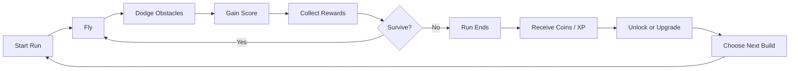

# Flapforge

> **A skill-based arcade roguelite where every flight makes the next one stronger.**

[](https://github.com/michelbr84/Flapforge/actions/workflows/build.yml)
[](https://github.com/michelbr84/Flapforge/actions/workflows/test.yml)
[](https://adoptium.net/)
[](https://gradle.org/)


[](LICENSE)

**Flapforge** reimagines the classic Flappy Bird formula as a **Skill-Based Arcade Roguelite with Persistent Meta-Progression**.

The core mechanic remains deliberately simple:

**Flap. Dodge. Survive. Score.**

But dying is no longer the complete end of the journey.

Every run can earn resources, unlock new birds, abilities, modifiers, challenges, environments, and permanent upgrades that expand what becomes possible in future runs.

The result is a game that preserves the instant accessibility and mechanical precision of Flappy Bird while introducing a long-term progression loop inspired by modern roguelites.

---

## Table of Contents

- [About](#about)
- [Genre](#genre)
- [Core Concept](#core-concept)
- [Gameplay Loop](#gameplay-loop)
- [Meta-Progression](#meta-progression)
- [Example Progression](#example-progression)
- [Features](#features)
- [Birds and Builds](#birds-and-builds)
- [Upgrades](#upgrades)
- [Challenges and Boss Runs](#challenges-and-boss-runs)
- [World Progression](#world-progression)
- [Difficulty](#difficulty)
- [Game Modes](#game-modes)
- [Controls](#controls)
- [Getting Started](#getting-started)
- [Running the Game](#running-the-game)
- [Technology](#technology)
- [Project Structure](#project-structure)
- [Design Philosophy](#design-philosophy)
- [Roadmap](#roadmap)
- [Original Project](#original-project)
- [Assets and Third-Party Content](#assets-and-third-party-content)
- [Contributing](#contributing)
- [License](#license)
- [Disclaimer](#disclaimer)
- [Acknowledgments](#acknowledgments)

---

## About

Traditional Flappy Bird is almost entirely based on immediate player skill.

You start.

You flap.

You avoid pipes.

You score.

You crash.

You start again.

**Flapforge keeps that loop but gives every run a larger purpose.**

A failed run may still provide:

- Coins.
- Experience.
- Upgrade materials.
- New birds.
- Passive abilities.
- New modifiers.
- New environments.
- Challenge access.
- Upgrade-tree progression.
- Permanent account progression.

The player becomes better at the game while the game itself gradually becomes deeper.

That distinction is at the center of Flapforge.

---

## Genre

> **Skill-Based Arcade Roguelite with Persistent Meta-Progression**

Flapforge is intentionally described as an **Arcade Roguelite**, rather than a traditional roguelike.

The game combines three major ideas:

### Arcade

Runs are:

- Fast.
- Immediate.
- Score-driven.
- Mechanically simple.
- Primarily based on player skill.

### Roguelite

Each run can introduce:

- Different upgrades.
- Different modifiers.
- Different strategies.
- Increasing difficulty.
- Special challenges.
- Meaningful risk and reward.

### Meta-Progression

Some progress survives death.

Players gradually unlock permanent content that changes future runs and expands the game's possibilities.

---

## Core Concept

The original Flappy Bird question is:

> **How far can you fly?**

Flapforge adds another:

> **What will this run unlock for the next one?**

A single input still controls the game's fundamental movement.

The complexity comes from everything surrounding that mechanic.

Players must decide how to combine skill, unlocked abilities, birds, upgrades, temporary run bonuses, and long-term progression to push farther into the game.

---

## Gameplay Loop



At its simplest:

```text
Play
  ↓
Survive
  ↓
Score
  ↓
Earn
  ↓
Die
  ↓
Upgrade
  ↓
Unlock
  ↓
Play Again
```

Each cycle should make the player feel that the next run has the potential to be different from the last.

---

## Meta-Progression

The most important difference between Flapforge and a traditional Flappy Bird game is **persistent progression**.

A run may end, but the player's overall journey continues.

Persistent progression includes:

| System | Description |
| --- | --- |
| **Currency** | Earn coins during runs and spend them in the shop |
| **Birds** | Unlock seven playable birds with different characteristics |
| **Abilities** | Unlock and level up eight mechanics and special actions |
| **Upgrade Trees** | Permanently improve specific aspects of future runs across three trees |
| **Worlds** | Unlock five environments and their obstacle sets |
| **Challenges** | Access seven special runs with unique rules |
| **Milestones** | Reward long-term achievements (41 in total) |
| **Difficulty Tiers** | Open harder variants (`hard`, `nightmare`) with better rewards |
| **Modifiers** | Draft run-changing cards mid-run |
| **Collections** | Give players long-term completion goals |
| **Daily Challenge** | One deterministic run per UTC day, with a recorded best |
| **Seeded Runs** | Replay a seed to race yourself or share a challenge |
| **Prestige** | Bank a career at level 25 for a permanent coin bonus and a golden palette |

Progress should increase **possibilities**, not simply remove the need for skill.

A skilled new player should still be capable of impressive runs.

A progressed player should have more options for approaching those runs.

---

## Example Progression

A simplified early-game progression could look like this:

| Run | Progression |
| --- | --- |
| **Run 1** | Classic flight → earn ≈ 50 coins |
| **Run 2–3** | Purchase a movement upgrade, unlock a bird with a special ability |
| **Run 3** | Unlock the defensive bird (Ironbeak, innate shield) |
| **Run 5** | Unlock the shield ability |
| **Run 7** | Gain access to run modifiers (or buy in for 150 coins earlier) |
| **≈ Run 3–10** | Unlock a new environment and obstacle family (Wind Valley) |
| **Challenge** | Complete a special objective |
| **Boss Run** | Defeat a world boss and open the next world |
| **Level 25** | Bank the career with a prestige |

This progression is not intended to make every run easier.

Instead, it continuously introduces new decisions.

---

## Features

### Classic skill-based flight

The heart of the game remains familiar:

- Gravity constantly pulls the bird downward.
- Pressing the flap control generates upward movement.
- Obstacles move toward the player.
- Passing obstacles increases the score.
- Collision ends the run.

The control scheme remains intentionally minimal.

### Persistent progression

Earn resources during runs and use them to expand future possibilities.

### Unlockable birds

Different birds can support different play styles.

Examples:

- Balanced bird.
- Lightweight bird.
- Heavy bird.
- Defensive bird.
- High-risk bird.
- Economy-focused bird.
- Ability-focused bird.

### Abilities

The eight shipped abilities:

- Double Flap.
- Shield.
- Dash.
- Slow Time.
- Emergency Recovery.
- Coin Magnet.
- Score Multiplier.
- Temporary Invulnerability.

Abilities must be balanced carefully so that precision remains the foundation of the game.

### Upgrade trees

Progress through permanent upgrade paths that allow players to specialize their account.

### Dynamic obstacles

The Java project that inspired Flapforge already expands on basic Flappy Bird mechanics with moving and floating pipe behavior.

Flapforge uses dynamic obstacle design as a foundation for increasingly complex environments.

### Increasing difficulty

Runs become progressively harder through combinations of:

- Faster scrolling.
- Smaller openings.
- Moving obstacles.
- Changing obstacle patterns.
- Environmental hazards.
- Run modifiers.
- Challenge-specific rules.

### Challenges

Special runs can change normal gameplay conditions and reward mastery.

### Boss encounters

Bosses do not need to behave like traditional action-game enemies.

In Flapforge, a boss can instead be a carefully designed sequence of mechanics.

For example:

```text
Normal Run
   ↓
Warning Zone
   ↓
Boss Challenge
   ↓
Complex Obstacle Pattern
   ↓
Survive for 30 Seconds
   ↓
Permanent Unlock
```

### Achievements, milestones and collections

Forty-one achievements are judged automatically as runs finish and purchases
land: lifetime counters, per-run records, and collection percentages. The
Achievements screen has three tabs — the achievements themselves (hidden ones
show as `???` until they fire), milestones with progress bars toward the next
level rewards and lifetime thresholds, and collections showing how much of
each content category is owned. Every newly earned achievement and granted
unlock raises a toast when it happens, naming the coins it paid.

### Music

Each world plays its own procedurally rendered chiptune loop — a deterministic
eight-bar sequence generated from the world's music block (tempo, scale,
seed, layers) at run start, crossfaded to a faster variant while a boss fight
runs. The menu plays the Green Fields loop. No audio files ship; the
sequencer, synthesiser and software mixer generate everything.

### Accessibility

Four settings, all live (they take effect without a restart) and persisted:

- **High contrast** — stronger hazard and bird outlines, opaque HUD panels,
  and a cap on world darkness so veiled worlds stay readable.
- **Colour-blind palettes** — protanopia, deuteranopia and tritanopia
  simulations re-tint every world palette and the semantic colours (danger
  telegraphs, coins, flames) while keeping hazard, telegraph and coin
  luminance separated.
- **Text scale** — the UI grows up to 1.5× and every screen reflows.
- **Hold to flap** — holding the flap input flaps continuously instead of
  once per press.

---

## Birds and Builds

Birds should be more than cosmetic skins.

Each bird can represent a different approach to the game.

Example:

| Bird Archetype | Strength | Weakness |
| --- | --- | --- |
| **Balanced** | Predictable movement | No major advantage |
| **Swift** | Fast reaction potential | Harder to control |
| **Heavy** | Stable descent | Requires stronger timing |
| **Guardian** | Defensive ability | Lower reward multiplier |
| **Gambler** | Increased rewards | Increased difficulty |
| **Mystic** | Ability-focused | Longer cooldowns |
| **Forge Bird** | Upgrade synergy | Weak early in a run |

Combined with upgrades and modifiers, birds can create recognizable **builds**.

For example:

```text
Guardian Bird
+ Shield Recharge
+ Extra Shield Charge
+ Reduced Coin Gain
= Defensive Build
```

or:

```text
Gambler Bird
+ Score Multiplier
+ Faster Pipes
+ Bonus Coins
= High-Risk Economy Build
```

---

## Upgrades

Flapforge has two major categories of upgrades.

### Run Upgrades

Temporary upgrades exist only during the current run. They ship as the
mid-run modifier drafts: at fixed gates a breather offers a choice of three
rarity-weighted cards, and set-bonus synergies fire when the build completes
a pattern.

Examples:

- +10% score.
- Temporary shield.
- Increased coin drops.
- Slower obstacles.
- Faster ability recharge.
- Smaller bird hitbox.
- Bonus reward for consecutive pipes.

These disappear when the run ends.

### Permanent Upgrades

Meta-progression upgrades remain unlocked.

Examples:

- Start with one shield charge.
- Increase maximum ability level.
- Unlock additional birds.
- Unlock new upgrade choices.
- Improve reward generation.
- Unlock challenge tiers.
- Unlock additional worlds.

This creates two connected progression layers:

```text
RUN PROGRESSION
Temporary power gained during one attempt

        +

META-PROGRESSION
Permanent options unlocked across attempts
```

---

## Challenges and Boss Runs

Challenges provide structured goals beyond simply beating a high score. Seven
ship with the game:

### No Shield

Survive a target distance without defensive abilities.

### Speed Run

Obstacle speed continually increases.

### Tiny Wings

Reduced flap strength changes the normal movement rhythm.

### Moving World

Every obstacle uses movement patterns.

### One Life

No shields, revives, or recovery abilities.

### Coin Rush

Score matters less than collecting as many resources as possible.

### Boss Corridor

Survive a handcrafted sequence of increasingly difficult obstacles.

Successful challenges can unlock:

- Birds.
- Abilities.
- Upgrade branches.
- Worlds.
- Difficulty levels.
- Cosmetic rewards.
- Permanent modifiers.

---

## World Progression

New environments should introduce mechanical changes, not only visual changes.

Example progression:

```text
World 1 — Green Fields
Classic pipes and basic movement.

World 2 — Wind Valley
Horizontal and vertical wind effects.

World 3 — Iron Forge
Mechanical obstacles and moving gates.

World 4 — Storm Sky
Lightning, visibility changes and faster patterns.

World 5 — Void
Advanced obstacle combinations and unstable rules.
```

A world can contain:

- Unique visuals.
- Unique obstacle families.
- Different music and sound design.
- Exclusive challenges.
- Exclusive unlocks.
- Different difficulty curves.

Worlds unlock in order: clearing a world's boss opens the next one, or the
next world can be bought in the shop. A launch can also pin any world with
`--world <id>`.

---

## Difficulty

Flapforge should remain fundamentally skill-based.

Progression is intended to provide **new tools and strategies**, not turn the game into an automatic win.

The ideal difficulty curve is:

```text
Easy to understand
        ↓
Difficult to master
        ↓
Progression introduces options
        ↓
Options enable deeper strategies
        ↓
New content introduces new challenges
        ↓
Player mastery remains important forever
```

This allows both systems to progress simultaneously:

**Player skill**

and

**Player account progression**

---

## Game Modes

The bird selection screen has a run-mode row beside the world and tier rows.
Four modes exist; Challenges live on their own menu screen.

### Standard

A fresh random seed every run. This is the default mode and the one the whole
meta-progression is tuned around.

### Seeded

Replays the seed of the last run the profile finished, so a run can be retried
on exactly the obstacles that killed you — or shared as "beat my 63 gates on
this seed". Seeded mode and Daily mode open together with the
`feature:seeded_runs` unlock (level 5, or 100 coins in the shop); while it is
locked the picker says so, and Play falls back to a standard run.

### Daily

One run per UTC day for the whole planet, no server involved: the seed is
nothing but the date (`fnv1a("daily:" + yyyy-MM-dd)`), and from it the game
deterministically picks one world, one tier from `{normal, hard}` and two
forced modifiers — all drawn only from content *you* have unlocked. Daily
runs pay ×1.25 coins. The pick is written to the profile the first time the
mode is viewed or played and is then frozen for that date, so unlocking new
content at lunchtime cannot change the run you were practising in the morning
— only the attempt counter and the best gate count move, and an instant
retry keeps the same seed. Daily mode is recorded per attempt
(attempts, best gates) in the statistics.

### Challenge

The seven special runs of the Challenges menu — their world, tier, rules,
forced cards and boss are the challenge's own; a challenge is playable whether
or not its world is unlocked.

### Difficulty tiers

Stacked on top of every mode except where a challenge fixes its own:

| Tier | Effects | Flags | Reward multiplier | Unlocked by |
| --- | --- | --- | --- | --- |
| `normal` | — | — | ×1.0 | default |
| `hard` | scroll ×1.10, gap ×0.92 | — | ×1.5 | 40 gates in one run, 400 across the profile, or the `hard_tier_1` node |
| `nightmare` | scroll ×1.20, gap ×0.85 | every obstacle moves, lethal ceiling | ×2.5 | the `boss_corridor_1` challenge or level 20 |

### Prestige

At level 25 the statistics screen offers a prestige (a two-step confirm, at
most five per profile). It banks the career against a baseline snapshot,
resets coins, XP, level, upgrades, ability levels, challenge records and the
daily pick, and keeps every bird, cosmetic, achievement and lifetime
statistic. What you keep forever is the badge on the menu, a
+5 % coin multiplier per prestige on every later run, and the golden
`prestige` palette of the bird you prestige with. Unlock conditions that count
a lifetime total read "since prestige" afterwards, so nothing already earned
is granted twice.

### Attract mode

Idle on the main menu for twenty seconds and a bot plays a demo run behind
it, dimmed under the menu. Any input takes the game back.

---

## Controls

| Input | Action |
| --- | --- |
| `Space`, `Up arrow`, left mouse button | Flap |
| `X`, `Shift`, right mouse button | Use the equipped active ability |
| `Esc` | Pause the run / go back a screen |
| `Enter` | Confirm the focused item |
| `M` | Mute / unmute audio |
| `F3` | Toggle the debug overlay (tick rate, frame time, seed) |
| `F11` | Toggle borderless fullscreen |

Menus are fully usable with either input device: arrow keys or `Tab` move
focus, `Enter`/`Space` activate, `Esc` goes back, and every control also
responds to mouse hover and click. All seven keyboard bindings above are
rebindable in the Settings screen; the arrow keys, `Esc`-to-go-back and the
mouse buttons are fixed.

On the game-over strip `Space` (or a left click) retries instantly with a
fresh seed — rewards are banked the moment the run ends, so a retry never
loses them. A daily's retry keeps its seed and only counts the attempt.

On Android the same actions are touch gestures — tap to flap, a second
finger or the HUD badge for the ability, drag to scroll, the system back
gesture for `Esc`; the table is under [Android](#android).

`M`, `F3` and `F11` work on every screen and are remembered: each one changes
the matching setting, so the game starts up the way you left it.

The world is picked in the bird selection screen (the world row lists the
five worlds, what each spawns and, for a locked one, the cheapest way in) or
pinned for one launch with `--world <id>` — see [Running the Game](#running-the-game).

Two menu entries sit beside Play: **Challenges** (pick one of the seven
special runs, read its objective and rewards, and start it with the current
bird, palette and loadout) and **Achievements** (the three tabs described
under [Features](#features)). Both take the same keyboard focus ring and
mouse input as every other screen, and both honour the text scale and
colour-blind settings.

Input is sampled per simulation tick (60 Hz), so a tap shorter than a frame
is never lost and key auto-repeat never produces an extra flap.

The game intentionally keeps the primary control simple so that difficulty
comes from timing, positioning, obstacle recognition, and build decisions
rather than complicated input combinations.

---

## Getting Started

### Requirements

- **JDK 17 or newer** (any distribution: Temurin, Microsoft, Zulu, your
  distro's `openjdk-17-jdk`, ...). The project is compiled with
  `--release 17`, so a newer JDK on the machine is fine.
- **No Gradle installation.** The repository ships the Gradle wrapper
  (`gradlew` / `gradlew.bat`), which downloads Gradle 9.7.1 on first use.
- A desktop session: Linux (X11 or Wayland), Windows 10+, or macOS 12+.
  Flapforge is a plain AWT/Java2D application; it needs no OpenGL, no native
  libraries and no game engine.
- Or an **Android 13 or newer** phone or tablet (`minSdk 33`) for the
  Android build — see [Android](#android).
- Git, if cloning the source repository.

Verify Java:

```bash
java -version
```

### Clone and build

```bash
git clone https://github.com/michelbr84/Flapforge.git
cd Flapforge
./gradlew build          # Windows: gradlew.bat build
```

`build` compiles with all lint warnings treated as errors and runs the
default test suite. The first run downloads Gradle and the two dependencies
(Gson, JUnit); afterwards `./gradlew --offline build` works without network.

See [`docs/DEVELOPMENT.md`](docs/DEVELOPMENT.md) for every Gradle task, the
GUI smoke tests and the coding rules, and [`CONTRIBUTING.md`](CONTRIBUTING.md)
if you want to send a change.

---

## Running the Game

### From source

```bash
./gradlew run
./gradlew run --args="--seed 42 --scale 2"     # pass launch flags through --args
```

### Self-contained jar

```bash
./gradlew fatJar
java -jar build/libs/flapforge-0.1.0-all.jar
java -jar build/libs/flapforge-0.1.0-all.jar --fullscreen --no-audio
java -jar build/libs/flapforge-0.1.0-all.jar --lang pt_BR
```

The jar bundles Gson and needs only a JRE/JDK 17+.

### Packaged app image

`scripts/package.sh` (Linux/macOS, or Git Bash on Windows) builds the fat jar,
exports the procedurally drawn icon in three formats and runs `jpackage` to
write a self-contained app image to `build/dist/` — `Flapforge/` on Linux,
`Flapforge.app` on macOS, `Flapforge/` on Windows, each with its platform's
icon (`.png` / `.icns` / `.ico`). `jpackage` ships with JDK 14+; the script
exits with a clear message when it cannot find one.

### Scripts

`scripts/run.sh` (Linux/macOS) and `scripts\run.ps1` (Windows) start the
game through Gradle and forward every argument to it; `scripts/build.sh` /
`scripts\build.ps1` run `build fatJar`; `scripts/package.sh` produces the
app image above.

```bash
scripts/run.sh --seed 42 --world storm_sky --bird zephyr
```

Release artefacts are built by CI: pushing a `v*` tag runs
[`.github/workflows/release.yml`](.github/workflows/release.yml), which
builds, tests and packages on all three operating systems and attaches the
per-OS app-image zips and the fat jar to the GitHub release.

Launch flags (all of them shipped; details in
[`docs/DEVELOPMENT.md`](docs/DEVELOPMENT.md)):

| Flag | Meaning |
| --- | --- |
| `--seed N` | fixed RNG seed for a reproducible run |
| `--world ID` | start in a given world (`green_fields`, `wind_valley`, `iron_forge`, `storm_sky`, `void`); a locked world is played for this launch only and the profile's selection is left alone (a log line says so) |
| `--bird ID` | start with a given bird |
| `--tier ID` | difficulty tier (`normal`, `hard`, `nightmare`) |
| `--scale N` | initial window scale (integer multiple of the 420×640 playfield); default: the largest scale whose window fits the screen |
| `--fullscreen` | start in borderless fullscreen (`F11` toggles) |
| `--no-audio` | start silent: no sound device is opened at all |
| `--home DIR` | use `DIR` instead of the default settings/save directory (`~/.flapforge`, `%APPDATA%\Flapforge`, `~/Library/Application Support/Flapforge`) for windowed launches; a headless run reads and writes no profile |
| `--headless-run N` | simulate `N` frames without a window and print a summary line plus the determinism hash CI compares across platforms |
| `--no-window` | run without a window |
| `--help`, `-h` | print the usage text |
| `--reset-save` | start from a fresh profile; the old save and its backup are moved aside as `save.reset-<time>.json` and `save.bak.reset-<time>.json`, never deleted |
| `--lang CODE` | UI language for this launch: `auto` (system locale), `en`, `pt_BR`; it can also be changed live in Settings |

### Android

Flapforge also runs on **Android 13 or newer** (`minSdk 33`, built against
API 36) — without libGDX or any other engine: the same game sources are
compiled against small stand-ins for the AWT, `javax.sound.sampled` and
`javax.imageio` classes they use, written over `android.graphics` and
`android.media` (see [Technology](#technology)). The port is part of the
`0.1.0` release; there is no separate Android version.

**Install the released APK.** Download `Flapforge-0.1.0-android.apk` from the
[v0.1.0 release](https://github.com/michelbr84/Flapforge/releases/tag/v0.1.0)
and open it on the device. The APK is signed with a debug key and distributed
by sideloading, so Android asks you to allow installs from the app you open it
with ("install unknown apps"). An APK built with a different debug key cannot
update it in place: uninstall first, then install the other one. Settings and
the save live in the app's private files directory; the desktop profile
directory is never used.

**Build it yourself.** Besides the JDK you need the Android SDK with platform
`android-36` and build-tools `36.0.0` (`sdkmanager --install
"platforms;android-36" "build-tools;36.0.0"`) and an `android/local.properties`
that tells Gradle where the SDK is (git-ignored; `ANDROID_HOME` works too):

```properties
sdk.dir=/home/you/Android/Sdk
```

The Android project is a separate Gradle build under `android/`, driven by the
same wrapper:

```bash
./gradlew -p android assembleRelease   # -> android/build/outputs/apk/release/Flapforge-android-release.apk
./gradlew -p android test              # Robolectric unit tests; no device or emulator needed
```

`assembleRelease` first rewrites the desktop sources against the shim packages
(`transformSources`) and checks the rewrite in both directions before
compiling; the desktop tree is never modified. The details, the integrity gate
and its self-test are in [`docs/DEVELOPMENT.md`](docs/DEVELOPMENT.md).

**Touch controls.** The game is always fullscreen and portrait (the manifest
opts out of Android 16's large-screen resizability, so tablets stay portrait
too); the 420×640
playfield is scaled to the screen and letterboxed. A finger is the mouse:

| Touch | Action |
| --- | --- |
| Tap anywhere | Flap — and hold to keep flapping: *Hold to flap* is on by default on Android and can be switched off in Settings |
| A second finger while the first is down, or a tap on the ability badge in the top-left corner of the HUD | Use the equipped active ability |
| Drag up or down | Scroll a list (the mouse wheel) |
| System back gesture | Pause the run / go back a screen (`Esc`) |
| Tap a button, row, tab or slider | Activate it — menus tap and drag exactly as they click and scroll on the desktop |

The launch flags above are desktop-only: the app starts with the defaults (a
fresh random seed, the device language unless Settings says otherwise, audio
on) and reads no keys. Mute, the volumes and the debug overlay are in
Settings; the fullscreen toggle there has no effect, the app is always
fullscreen. Leaving the app pauses a live run and silences the audio at once;
quitting from the menu saves before the process ends, as on the desktop.
This describes what the code does and what the Robolectric unit tests verify
in the JVM; those tests cannot drive a real display surface, time the audio or
measure performance, so a device run remains the final check (see
[`docs/ARCHITECTURE.md`](docs/ARCHITECTURE.md), "What Robolectric verifies,
and what it cannot").

---

## Technology

Flapforge is written in **Java 17** on top of the standard desktop libraries
only. There is no game engine and no native code.

| Technology | Purpose |
| --- | --- |
| **Java 17** | language level (`--release 17`), compiled warning-free with `-Xlint:all -Werror` |
| **AWT / Java2D** | a `java.awt.Frame` with a `Canvas` and a double-buffered `BufferStrategy`; every screen, sprite and effect is drawn with Java2D. No Swing anywhere. |
| **Android port** (`android/`) | the same sources, rewritten at build time so that `java.awt.*`, `javax.sound.sampled.*` and `javax.imageio.*` resolve to three small shim packages over `android.graphics` and `android.media`; a `SurfaceView` presenter, touch gestures and the activity lifecycle replace the desktop window. A separate Gradle build (AGP 9.4.0 on the same wrapper), `minSdk 33`, Robolectric unit tests; no libGDX, no androidx, no Kotlin standard library |
| **Gradle 9.7.1** (wrapper) | build, tests (`test`, `smokeTest`, `perfTest`, `simTest`), tools, fat jar |
| **Gson 2.14.0** | the only runtime dependency: JSON content, settings and save files |
| **JUnit Jupiter** | unit, property, simulation, headless-render and real-window smoke tests |
| **Procedural art and audio** | all visuals are generated from per-world palettes and bird archetypes; sound effects and music come from a software synthesiser and sequencer — no image or audio files are required to play. The one shipped binary asset is the bundled OFL-licensed UI font (`Nunito`), declared in `assets/manifest.json` and installed at boot; without it the game falls back to the JDK's logical font |
| **Data-driven content** | birds, upgrades, abilities, modifiers, worlds, obstacle patterns, challenges, achievements and UI strings are JSON files, validated at start-up |
| **Local persistence** | a versioned save file and settings under `~/.flapforge` (Linux), `%APPDATA%\Flapforge` (Windows) or `~/Library/Application Support/Flapforge` (macOS), written atomically with backups and migrations |

Under the hood the game runs a fixed **60 Hz simulation** on a dedicated loop
thread with interpolated rendering, and the whole simulation, progression
and save stack is **headless**: the same code that the player runs powers
the bots, the balancing tools and the cross-platform determinism check in
CI. The architecture is described in [`docs/ARCHITECTURE.md`](docs/ARCHITECTURE.md).

---

## Project Structure

Flapforge is a single Gradle module under the package
`io.github.michelbr84.flapforge`, organised in four layers. Dependencies only
point downwards, and the two lower layers never touch AWT, the clock,
threads or global randomness — a rule enforced by a test.

```text
Flapforge/
├── build.gradle, settings.gradle, gradle.properties, gradlew*   Gradle 9.7.1 project (wrapper included)
├── src/main/java/io/github/michelbr84/flapforge/
│   ├── Flapforge.java      entry point: parses launch flags, boots the application
│   │
│   │   ── 1. application shell ──
│   ├── app/                window, loop thread, AWT input bridge, frame presenter, clocks, threads
│   │
│   │   ── 2. presentation ──
│   ├── render/             procedural art, viewport scaling, fonts, renderers, debug overlay
│   ├── audio/              software mixer, tone synthesiser, music sequencer
│   ├── ui/                 screen stack, focus handling, components, screens
│   ├── event/              presentation-side event bus (audio, particles, toasts)
│   │
│   │   ── 3. simulation (pure) ──
│   ├── core/               playfield constants, geometry, math, seeded RNG, TimeSource
│   ├── input/              actions, key codes, per-tick input frames, bindings
│   ├── gameplay/           bird, obstacles, collision, stats pipeline, difficulty, run state machine, bot harness
│   ├── ability/            active and passive ability behaviours
│   ├── modifier/           roguelite modifier pool, rarity and synergies
│   │
│   │   ── 4. meta (pure) ──
│   ├── content/            JSON loader, strict binding, validator, unlock graph, strings
│   ├── progression/        player profile, wallet, level, unlocks, upgrades, achievements, prestige
│   └── persistence/        settings and save files: atomic writes, backups, migrations
├── src/main/resources/
│   ├── data/               birds, difficulty, economy, upgrades, abilities, modifiers, worlds, patterns, challenges, achievements (JSON)
│   ├── data/strings/       en.json (source of truth), pt_BR.json
│   ├── assets/             manifest.json plus optional override folders for future art, audio and fonts
│   └── version.properties
├── src/test/               unit, property, simulation, headless render and GUI smoke tests; fixtures
├── src/tools/              balancing simulator, save inspector, content check, asset validator, icon export
├── scripts/                build, run and package wrappers (sh + ps1)
├── docs/                   game design, architecture, progression, balancing, content, save system, development, roadmap
├── android/                Android port (M10): its own Gradle build, the build-time source transform, the awt/jssound/jimageio shims, the Android host, the launcher-icon generator, Robolectric tests
└── .github/                CI and release workflows, dependabot, issue and pull request templates
```

The full package tree, the layer rules and the loop/presenter/input design
are documented in [`docs/ARCHITECTURE.md`](docs/ARCHITECTURE.md).

Keeping the roguelite systems as plain data and pure code, separate from the
window and the renderer, is what lets the game be simulated, balanced and
verified without ever opening a window.

---

## Design Philosophy

Flapforge is guided by several principles.

### 1. One button should still be enough

The original mechanic is powerful because anyone can immediately understand it.

Flapforge should preserve that accessibility.

### 2. Skill comes first

Meta-progression should complement player skill rather than replace it.

### 3. Every run should matter

Even a failed run should be capable of contributing something:

- Currency.
- Experience.
- Knowledge.
- Unlock progress.
- Challenge progress.
- Achievement progress.

### 4. Unlock options, not just numbers

A new ability is generally more interesting than a permanent `+1%` bonus.

Progression should increasingly change **how the player can play**.

### 5. Short runs, long journey

Individual runs should remain fast.

The complete progression journey can last much longer.

### 6. Death should create motivation

The desired reaction after losing is not:

> "I have to do the exact same thing again."

It is:

> "One more run — I can unlock something."

---

## Roadmap

Version 0.1.0 ships the complete first pass of the design: the classic core,
the meta-progression (coins, XP, seven birds, eight abilities, three upgrade
trees, shops), the roguelite layer (modifier drafts, synergies), five worlds
with bosses, seven challenges, 41 achievements, difficulty tiers, the daily
challenge, seeded runs, prestige, attract mode, accessibility settings and
the packaged release. The per-milestone history is in
[`CHANGELOG.md`](CHANGELOG.md) and the design in
[`docs/GAME_DESIGN.md`](docs/GAME_DESIGN.md). The Android port (M10) joined the
same release after the tag, as the APK attached to it — see [Android](#android).

Everything the first release deliberately leaves out — leaderboards, challenge
sharing, mod packs, endless tiers, original art and audio packs, and the rest
— is listed with reasons and next-step anchors in
[`docs/ROADMAP.md`](docs/ROADMAP.md).

---

## Original Project

Flapforge is based on and inspired by:

### kingyuluk/FlappyBird

**Repository:**  
[github.com/kingyuluk/FlappyBird](https://github.com/kingyuluk/FlappyBird)

The original Java project provides the core Flappy Bird desktop-game foundation, including:

- Bird physics.
- Gravity.
- Flap controls.
- Collision detection.
- Scoring.
- Pipe generation.
- Moving pipes.
- Floating pipes.
- Difficulty progression.
- Graphics.
- Sound playback.
- Java desktop application structure.

Flapforge extends this foundation toward a substantially different game design centered on:

- Roguelite runs.
- Persistent progression.
- Unlockable content.
- Character variety.
- Abilities.
- Upgrade trees.
- Challenges.
- Additional worlds.
- Long-term replayability.

Huge credit goes to **Kingyu Luk / kingyuluk** for making the original Java implementation publicly available.

---

## Assets and Third-Party Content

**Flapforge ships no inherited assets.** The upstream project bundled sprites,
backgrounds, number fonts, title artwork and sound effects that it described
as "obtained from the internet for learning purposes", and some of them
reproduced the Flappy Bird wordmark and character. Because the MIT licence
covers the upstream *source code* and says nothing about those files, they
were removed from the working tree at the start of the rewrite. They survive
only in git history and are not part of any build, jar or release.

Instead, the game is **procedural-first**:

- every image — backgrounds, pipes, gears, pistons, lightning, birds, UI,
  the application icon — is drawn at runtime from per-world palettes and
  bird archetypes;
- every sound effect and music track is synthesised by a software mixer;
- text is drawn with the bundled open (OFL-licensed) Nunito font, with the
  JDK's logical font as the fallback if the font entry is ever broken.

Original artwork, audio and fonts are welcome later and have a defined
drop-in path: `src/main/resources/assets/manifest.json` maps an asset id to a
file, its kind, its licence and its provenance, and a listed sprite overrides
the procedural drawing for that id without code changes. Anything added
there must carry a licence that allows redistribution and must be recorded
in [`THIRD_PARTY_NOTICES.md`](THIRD_PARTY_NOTICES.md), which also holds the
upstream attribution and the notices for the bundled runtime dependency
(Gson, Apache 2.0).

Software licensing and asset licensing remain separate concerns: the MIT
licence in [`LICENSE`](LICENSE) covers Flapforge's code, not any third-party
image, sound, font or trademark.

---

## Contributing

Contributions are welcome.

Good contribution areas include:

- Gameplay mechanics.
- Progression balancing.
- New birds.
- New abilities.
- Upgrade-system design.
- Challenge modes.
- New obstacle patterns.
- New worlds.
- Performance improvements.
- Bug fixes.
- UI improvements.
- Accessibility.
- Tests.
- Documentation.
- Original artwork and audio.

A typical workflow is:

```bash
git clone https://github.com/michelbr84/Flapforge.git
cd Flapforge

git checkout -b feature/my-feature
```

Make your changes, test them, and commit:

```bash
git add .
git commit -m "feat: add my feature"
```

Push the branch:

```bash
git push origin feature/my-feature
```

Then open a pull request.

For substantial gameplay or architecture changes, opening an issue or discussion before implementation is recommended.

---

## License

The software foundation used by Flapforge comes from the MIT-licensed
[`kingyuluk/FlappyBird`](https://github.com/kingyuluk/FlappyBird) project.

Flapforge should preserve all notices and attribution required by applicable upstream licenses.

See [`LICENSE`](LICENSE) for the licensing terms of this repository.

Third-party graphics, audio, fonts, trademarks, and other assets may be governed by separate licenses or rights.

---

## Disclaimer

Flapforge is an independent game project inspired by the gameplay concept popularized by **Flappy Bird**.

It is not an official Flappy Bird release and is not affiliated with or endorsed by the creators or rights holders of the original game.

"Flappy Bird" and any related names, characters, artwork, trademarks, or intellectual property remain the property of their respective owners.

The goal of Flapforge is to create a distinct arcade roguelite experience built around a simple flap-based flight mechanic and persistent progression.

---

## Acknowledgments

Special thanks to:

- **Kingyu Luk / kingyuluk** for the original Java Flappy Bird implementation.
- The Java and open-source communities.
- Developers who continue experimenting with simple arcade mechanics in new ways.
- Everyone who contributes code, testing, balancing, artwork, audio, ideas, and feedback to Flapforge.

---

## The Idea in One Sentence

> **Flapforge is Flappy Bird where every death ends the run — but not the journey.**

---

**Flap. Fail. Forge. Fly farther.**
