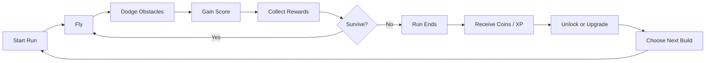

# Flapforge

> **A skill-based arcade roguelite where every flight makes the next one stronger.**

[](https://www.java.com/)


[](LICENSE)

**Flapforge** reimagines the classic Flappy Bird formula as a **Skill-Based Arcade Roguelite with Persistent Meta-Progression**.

The core mechanic remains deliberately simple:

**Flap. Dodge. Survive. Score.**

But dying is no longer the complete end of the journey.

Every run can earn resources, unlock new birds, abilities, modifiers, challenges, environments, and permanent upgrades that expand what becomes possible in future runs.

The result is a game that preserves the instant accessibility and mechanical precision of Flappy Bird while introducing a long-term progression loop inspired by modern roguelites.

---

## Table of Contents

- [About](#about)
- [Genre](#genre)
- [Core Concept](#core-concept)
- [Gameplay Loop](#gameplay-loop)
- [Meta-Progression](#meta-progression)
- [Example Progression](#example-progression)
- [Features](#features)
- [Birds and Builds](#birds-and-builds)
- [Upgrades](#upgrades)
- [Challenges and Boss Runs](#challenges-and-boss-runs)
- [World Progression](#world-progression)
- [Difficulty](#difficulty)
- [Controls](#controls)
- [Getting Started](#getting-started)
- [Running the Game](#running-the-game)
- [Technology](#technology)
- [Project Structure](#project-structure)
- [Design Philosophy](#design-philosophy)
- [Roadmap](#roadmap)
- [Original Project](#original-project)
- [Assets and Third-Party Content](#assets-and-third-party-content)
- [Contributing](#contributing)
- [License](#license)
- [Disclaimer](#disclaimer)
- [Acknowledgments](#acknowledgments)

---

## About

Traditional Flappy Bird is almost entirely based on immediate player skill.

You start.

You flap.

You avoid pipes.

You score.

You crash.

You start again.

**Flapforge keeps that loop but gives every run a larger purpose.**

A failed run may still provide:

- Coins.
- Experience.
- Upgrade materials.
- New birds.
- Passive abilities.
- New modifiers.
- New environments.
- Challenge access.
- Upgrade-tree progression.
- Permanent account progression.

The player becomes better at the game while the game itself gradually becomes deeper.

That distinction is at the center of Flapforge.

---

## Genre

> **Skill-Based Arcade Roguelite with Persistent Meta-Progression**

Flapforge is intentionally described as an **Arcade Roguelite**, rather than a traditional roguelike.

The game combines three major ideas:

### Arcade

Runs are:

- Fast.
- Immediate.
- Score-driven.
- Mechanically simple.
- Primarily based on player skill.

### Roguelite

Each run can introduce:

- Different upgrades.
- Different modifiers.
- Different strategies.
- Increasing difficulty.
- Special challenges.
- Meaningful risk and reward.

### Meta-Progression

Some progress survives death.

Players gradually unlock permanent content that changes future runs and expands the game's possibilities.

---

## Core Concept

The original Flappy Bird question is:

> **How far can you fly?**

Flapforge adds another:

> **What will this run unlock for the next one?**

A single input still controls the game's fundamental movement.

The complexity comes from everything surrounding that mechanic.

Players must decide how to combine skill, unlocked abilities, birds, upgrades, temporary run bonuses, and long-term progression to push farther into the game.

---

## Gameplay Loop



At its simplest:

```text
Play
  ↓
Survive
  ↓
Score
  ↓
Earn
  ↓
Die
  ↓
Upgrade
  ↓
Unlock
  ↓
Play Again
```

Each cycle should make the player feel that the next run has the potential to be different from the last.

---

## Meta-Progression

The most important difference between Flapforge and a traditional Flappy Bird game is **persistent progression**.

A run may end, but the player's overall journey continues.

Persistent progression can include:

| System | Description |
| --- | --- |
| **Currency** | Earn resources during runs and spend them between games |
| **Birds** | Unlock playable birds with different characteristics |
| **Abilities** | Unlock new mechanics and special actions |
| **Upgrade Trees** | Permanently improve specific aspects of future runs |
| **Worlds** | Unlock new environments and obstacle sets |
| **Challenges** | Access special runs with unique rules |
| **Milestones** | Reward long-term achievements |
| **Difficulty Tiers** | Open harder variants with better rewards |
| **Modifiers** | Change the rules of future runs |
| **Collections** | Give players long-term completion goals |

Progress should increase **possibilities**, not simply remove the need for skill.

A skilled new player should still be capable of impressive runs.

A progressed player should have more options for approaching those runs.

---

## Example Progression

A simplified early-game progression could look like this:

| Run | Progression |
| --- | --- |
| **Run 1** | Classic flight → earn 50 coins |
| **Run 2** | Purchase a movement upgrade |
| **Run 3** | Unlock a bird with a special ability |
| **Run 5** | Unlock a shield |
| **Run 7** | Gain access to run modifiers |
| **Run 10** | Unlock a new environment and obstacle family |
| **Challenge** | Complete a special objective |
| **Boss Run** | Defeat a major challenge |
| **Reward** | Unlock a new upgrade tree |

This progression is not intended to make every run easier.

Instead, it continuously introduces new decisions.

---

## Features

### Classic skill-based flight

The heart of the game remains familiar:

- Gravity constantly pulls the bird downward.
- Pressing the flap control generates upward movement.
- Obstacles move toward the player.
- Passing obstacles increases the score.
- Collision ends the run.

The control scheme remains intentionally minimal.

### Persistent progression

Earn resources during runs and use them to expand future possibilities.

### Unlockable birds

Different birds can support different play styles.

Examples:

- Balanced bird.
- Lightweight bird.
- Heavy bird.
- Defensive bird.
- High-risk bird.
- Economy-focused bird.
- Ability-focused bird.

### Abilities

Possible abilities include:

- Double Flap.
- Shield.
- Dash.
- Slow Time.
- Emergency Recovery.
- Coin Magnet.
- Score Multiplier.
- Temporary Invulnerability.

Abilities must be balanced carefully so that precision remains the foundation of the game.

### Upgrade trees

Progress through permanent upgrade paths that allow players to specialize their account.

### Dynamic obstacles

The Java project that inspired Flapforge already expands on basic Flappy Bird mechanics with moving and floating pipe behavior.

Flapforge uses dynamic obstacle design as a foundation for increasingly complex environments.

### Increasing difficulty

Runs become progressively harder through combinations of:

- Faster scrolling.
- Smaller openings.
- Moving obstacles.
- Changing obstacle patterns.
- Environmental hazards.
- Run modifiers.
- Challenge-specific rules.

### Challenges

Special runs can change normal gameplay conditions and reward mastery.

### Boss encounters

Bosses do not need to behave like traditional action-game enemies.

In Flapforge, a boss can instead be a carefully designed sequence of mechanics.

For example:

```text
Normal Run
   ↓
Warning Zone
   ↓
Boss Challenge
   ↓
Complex Obstacle Pattern
   ↓
Survive for 30 Seconds
   ↓
Permanent Unlock
```

---

## Birds and Builds

Birds should be more than cosmetic skins.

Each bird can represent a different approach to the game.

Example:

| Bird Archetype | Strength | Weakness |
| --- | --- | --- |
| **Balanced** | Predictable movement | No major advantage |
| **Swift** | Fast reaction potential | Harder to control |
| **Heavy** | Stable descent | Requires stronger timing |
| **Guardian** | Defensive ability | Lower reward multiplier |
| **Gambler** | Increased rewards | Increased difficulty |
| **Mystic** | Ability-focused | Longer cooldowns |
| **Forge Bird** | Upgrade synergy | Weak early in a run |

Combined with upgrades and modifiers, birds can create recognizable **builds**.

For example:

```text
Guardian Bird
+ Shield Recharge
+ Extra Shield Charge
+ Reduced Coin Gain
= Defensive Build
```

or:

```text
Gambler Bird
+ Score Multiplier
+ Faster Pipes
+ Bonus Coins
= High-Risk Economy Build
```

---

## Upgrades

Flapforge can support two major categories of upgrades.

### Run Upgrades

Temporary upgrades exist only during the current run.

Examples:

- +10% score.
- Temporary shield.
- Increased coin drops.
- Slower obstacles.
- Faster ability recharge.
- Smaller bird hitbox.
- Bonus reward for consecutive pipes.

These disappear when the run ends.

### Permanent Upgrades

Meta-progression upgrades remain unlocked.

Examples:

- Start with one shield charge.
- Increase maximum ability level.
- Unlock additional birds.
- Unlock new upgrade choices.
- Improve reward generation.
- Unlock challenge tiers.
- Unlock additional worlds.

This creates two connected progression layers:

```text
RUN PROGRESSION
Temporary power gained during one attempt

        +

META-PROGRESSION
Permanent options unlocked across attempts
```

---

## Challenges and Boss Runs

Challenges provide structured goals beyond simply beating a high score.

Examples:

### No Shield

Survive a target distance without defensive abilities.

### Speed Run

Obstacle speed continually increases.

### Tiny Wings

Reduced flap strength changes the normal movement rhythm.

### Moving World

Every obstacle uses movement patterns.

### One Life

No shields, revives, or recovery abilities.

### Coin Rush

Score matters less than collecting as many resources as possible.

### Boss Corridor

Survive a handcrafted sequence of increasingly difficult obstacles.

Successful challenges can unlock:

- Birds.
- Abilities.
- Upgrade branches.
- Worlds.
- Difficulty levels.
- Cosmetic rewards.
- Permanent modifiers.

---

## World Progression

New environments should introduce mechanical changes, not only visual changes.

Example progression:

```text
World 1 — Green Fields
Classic pipes and basic movement.

World 2 — Wind Valley
Horizontal and vertical wind effects.

World 3 — Iron Forge
Mechanical obstacles and moving gates.

World 4 — Storm Sky
Lightning, visibility changes and faster patterns.

World 5 — Void
Advanced obstacle combinations and unstable rules.
```

A world can contain:

- Unique visuals.
- Unique obstacle families.
- Different music and sound design.
- Exclusive challenges.
- Exclusive unlocks.
- Different difficulty curves.

---

## Difficulty

Flapforge should remain fundamentally skill-based.

Progression is intended to provide **new tools and strategies**, not turn the game into an automatic win.

The ideal difficulty curve is:

```text
Easy to understand
        ↓
Difficult to master
        ↓
Progression introduces options
        ↓
Options enable deeper strategies
        ↓
New content introduces new challenges
        ↓
Player mastery remains important forever
```

This allows both systems to progress simultaneously:

**Player skill**

and

**Player account progression**

---

## Controls

### Keyboard

| Key | Action |
| --- | --- |
| `Space` | Flap |

The game intentionally keeps the primary control simple so that difficulty comes from timing, positioning, obstacle recognition, and build decisions rather than complicated input combinations.

---

## Getting Started

### Requirements

- **Java JDK/JRE 8 or newer**
- Desktop environment capable of running Java applications
- Git, if cloning the source repository

Verify Java:

```bash
java -version
```

Verify the Java compiler when developing from source:

```bash
javac -version
```

---

## Running the Game

### Packaged JAR

If a packaged version of Flapforge is available:

```bash
java -jar Flapforge.jar
```

### From Source

Clone the repository:

```bash
git clone <repository-url>
cd Flapforge
```

Open the project in a Java IDE such as:

- IntelliJ IDEA
- Eclipse
- Visual Studio Code with Java extensions

Then run the application's `App.main()` entry point.

The project is intentionally based on a lightweight Java desktop architecture rather than requiring a large external game engine.

---

## Technology

Flapforge is built in **Java**.

The original project used as its technical foundation was written using Java's standard desktop libraries and targeted **JDK 8**.

Core technologies and concepts include:

| Technology | Purpose |
| --- | --- |
| **Java** | Main programming language |
| **Java AWT** | Windowing, rendering and desktop game loop foundation |
| **Java 2D** | Sprites and 2D rendering |
| **Keyboard Events** | Player input |
| **Audio** | Game sound effects |
| **Local Persistence** | Meta-progression and unlocked content |
| **Object-Oriented Design** | Birds, pipes, worlds and game systems |

No heavyweight game engine is required for the core gameplay.

---

## Project Structure

The project is derived from the architecture of
[`kingyuluk/FlappyBird`](https://github.com/kingyuluk/FlappyBird).

The foundation separates the application, game components, utilities, and resources.

A simplified representation is:

```text
Flapforge/
├── src/
│   └── main/
│       └── java/
│           └── ...
│               ├── app/
│               │   ├── App.java
│               │   └── Game.java
│               │
│               ├── component/
│               │   ├── Bird.java
│               │   ├── Pipe.java
│               │   ├── MovingPipe.java
│               │   ├── GameBackground.java
│               │   ├── GameForeground.java
│               │   └── ScoreCounter.java
│               │
│               └── util/
│                   ├── Constant.java
│                   └── ...
│
├── resources/
│   ├── img/
│   └── wav/
│
├── README.md
└── LICENSE
```

As the roguelite systems grow, Flapforge can extend this architecture with isolated systems for:

```text
progression/
upgrades/
abilities/
birds/
challenges/
worlds/
save/
economy/
achievements/
```

Keeping these systems separate from the basic flight mechanics makes it easier to expand the game without turning the core gameplay loop into a monolithic class.

---

## Design Philosophy

Flapforge is guided by several principles.

### 1. One button should still be enough

The original mechanic is powerful because anyone can immediately understand it.

Flapforge should preserve that accessibility.

### 2. Skill comes first

Meta-progression should complement player skill rather than replace it.

### 3. Every run should matter

Even a failed run should be capable of contributing something:

- Currency.
- Experience.
- Knowledge.
- Unlock progress.
- Challenge progress.
- Achievement progress.

### 4. Unlock options, not just numbers

A new ability is generally more interesting than a permanent `+1%` bonus.

Progression should increasingly change **how the player can play**.

### 5. Short runs, long journey

Individual runs should remain fast.

The complete progression journey can last much longer.

### 6. Death should create motivation

The desired reaction after losing is not:

> "I have to do the exact same thing again."

It is:

> "One more run — I can unlock something."

---

## Roadmap

### Phase 1 — Core Arcade Foundation

- [x] Java-based Flappy Bird gameplay foundation
- [x] Gravity and flap mechanics
- [x] Collision detection
- [x] Scoring
- [x] Randomized obstacle generation
- [x] Moving obstacles
- [ ] Flapforge branding and UI

### Phase 2 — Run Economy

- [ ] Run rewards
- [ ] Persistent currency
- [ ] Reward summary screen
- [ ] Player profile
- [ ] Save/load system
- [ ] Progress tracking

### Phase 3 — Meta-Progression

- [ ] Permanent upgrade system
- [ ] Upgrade tree
- [ ] Unlock conditions
- [ ] Multiple playable birds
- [ ] Bird-specific abilities
- [ ] Ability progression

### Phase 4 — Roguelite Layer

- [ ] Temporary run upgrades
- [ ] Random upgrade choices
- [ ] Build synergies
- [ ] Run modifiers
- [ ] Risk/reward mechanics
- [ ] Rarity system

### Phase 5 — Content

- [ ] Multiple environments
- [ ] New obstacle families
- [ ] Challenge runs
- [ ] Boss challenges
- [ ] Milestones
- [ ] Achievements

### Phase 6 — Polish

- [ ] Updated original artwork
- [ ] Original sound effects
- [ ] Music
- [ ] Settings
- [ ] Accessibility options
- [ ] Difficulty balancing
- [ ] Performance optimization
- [ ] Automated tests
- [ ] Packaged releases

### Long-Term Ideas

- [ ] Daily challenges
- [ ] Seeded runs
- [ ] Endless difficulty tiers
- [ ] Leaderboards
- [ ] Challenge sharing
- [ ] Statistics dashboard
- [ ] New Game+
- [ ] Prestige progression
- [ ] Mod support
- [ ] Community-created challenge packs

The roadmap represents the intended direction of the project and may evolve during development.

---

## Original Project

Flapforge is based on and inspired by:

### kingyuluk/FlappyBird

**Repository:**  
[github.com/kingyuluk/FlappyBird](https://github.com/kingyuluk/FlappyBird)

The original Java project provides the core Flappy Bird desktop-game foundation, including:

- Bird physics.
- Gravity.
- Flap controls.
- Collision detection.
- Scoring.
- Pipe generation.
- Moving pipes.
- Floating pipes.
- Difficulty progression.
- Graphics.
- Sound playback.
- Java desktop application structure.

Flapforge extends this foundation toward a substantially different game design centered on:

- Roguelite runs.
- Persistent progression.
- Unlockable content.
- Character variety.
- Abilities.
- Upgrade trees.
- Challenges.
- Additional worlds.
- Long-term replayability.

Huge credit goes to **Kingyu Luk / kingyuluk** for making the original Java implementation publicly available.

---

## Assets and Third-Party Content

The upstream project states that some image and audio resources were obtained from the internet for learning and educational use.

Because software licensing and asset licensing are separate concerns, contributors should **not assume that the MIT license covering source code automatically grants redistribution rights to every image, sound, font, trademark, or other asset contained in or inherited from the original project**.

For a production-quality or commercially distributed version of Flapforge, the recommended approach is to use:

- Original artwork.
- Original sound effects.
- Properly licensed music.
- Properly licensed fonts.
- Assets with clearly documented redistribution rights.

Third-party assets should have their origin and license documented whenever applicable.

---

## Contributing

Contributions are welcome.

Good contribution areas include:

- Gameplay mechanics.
- Progression balancing.
- New birds.
- New abilities.
- Upgrade-system design.
- Challenge modes.
- New obstacle patterns.
- New worlds.
- Performance improvements.
- Bug fixes.
- UI improvements.
- Accessibility.
- Tests.
- Documentation.
- Original artwork and audio.

A typical workflow is:

```bash
git clone <repository-url>
cd Flapforge

git checkout -b feature/my-feature
```

Make your changes, test them, and commit:

```bash
git add .
git commit -m "feat: add my feature"
```

Push the branch:

```bash
git push origin feature/my-feature
```

Then open a pull request.

For substantial gameplay or architecture changes, opening an issue or discussion before implementation is recommended.

---

## License

The software foundation used by Flapforge comes from the MIT-licensed
[`kingyuluk/FlappyBird`](https://github.com/kingyuluk/FlappyBird) project.

Flapforge should preserve all notices and attribution required by applicable upstream licenses.

See [`LICENSE`](LICENSE) for the licensing terms of this repository.

Third-party graphics, audio, fonts, trademarks, and other assets may be governed by separate licenses or rights.

---

## Disclaimer

Flapforge is an independent game project inspired by the gameplay concept popularized by **Flappy Bird**.

It is not an official Flappy Bird release and is not affiliated with or endorsed by the creators or rights holders of the original game.

"Flappy Bird" and any related names, characters, artwork, trademarks, or intellectual property remain the property of their respective owners.

The goal of Flapforge is to create a distinct arcade roguelite experience built around a simple flap-based flight mechanic and persistent progression.

---

## Acknowledgments

Special thanks to:

- **Kingyu Luk / kingyuluk** for the original Java Flappy Bird implementation.
- The Java and open-source communities.
- Developers who continue experimenting with simple arcade mechanics in new ways.
- Everyone who contributes code, testing, balancing, artwork, audio, ideas, and feedback to Flapforge.

---

## The Idea in One Sentence

> **Flapforge is Flappy Bird where every death ends the run — but not the journey.**

---

**Flap. Fail. Forge. Fly farther.**# Flapforge
# Flapforge
