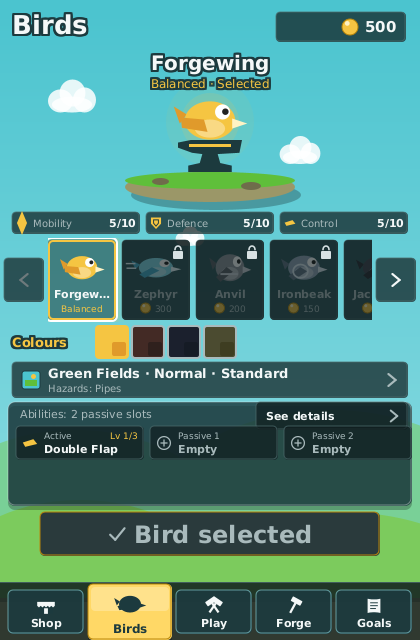

_Language:_ **English** · [[Português (Brasil)|Aves-e-Habilidades-(pt-BR)]]

# Birds and Abilities

Every run starts with one bird and one loadout of abilities. The bird sets the physics you fly
with (gravity, flap strength, fall speed) and, for most birds, a signature twist; the loadout
adds one active ability and a few passives on top. Both are chosen on the **Birds** screen,
reached from the bottom navigation of the [[Home Hub]]. Birds and abilities are earned through
play or bought with coins; prices, the wallet and refusals are covered on [[Shop and Upgrades]].

## The seven birds

All seven birds share the same 33 × 31 hitbox. What differs is the physics, the number of
passive slots and the signature. Names and descriptions are the game's own
(`bird.<id>.name` / `bird.<id>.desc`); the reference physics is Forgewing's gravity 1800,
flap 405 and maximum fall speed 1500 px/s.

| `id` | Name | Archetype | Passive slots | Signature | Earn it by | Or buy for |
| --- | --- | --- | --- | --- | --- | --- |
| `classic` | Forgewing | Balanced | 2 | No modifiers: the bird you learn on | available from the start | — |
| `swift` | Zephyr | Swift | 2 | Gravity 2100 and flap 470: a stronger flap under a heavier sky | passing 15 gates in one run | 300 coins |
| `heavy` | Anvil | Heavy | 2 | Gravity 2200, flap 460, and it never falls faster than 450 px/s | playing 4 runs | 200 coins |
| `guardian` | Ironbeak | Guardian | 2 | Flies with an innate Shield; −20 % coin multiplier | playing 3 runs | 150 coins |
| `gambler` | Jackdaw | Gambler | 2 | +30 % score and +30 % coins; gaps ×0.9; hitbox scale +0.10 | passing 25 gates in one run | 500 coins |
| `mystic` | Oracle | Mystic | 3 | Ability duration ×1.3 and cooldown ×1.4 | the Ability Adept achievement (use abilities 50 times) | 600 coins |
| `forge` | Cinder | Forge | 2 | +2 % score per gate passed (up to +50 %); +0.5 % flap and +1 % coins per owned upgrade level (up to +8 % / +25 %); base flap 385 | clearing the Green Fields boss | 800 coins |

The archetypes are meant to play differently, not just look different:

| Archetype | Strength | Weakness |
| --- | --- | --- |
| Balanced | Predictable movement | No major advantage |
| Swift | Fast reaction potential | Harder to control |
| Heavy | Stable descent | Requires stronger timing |
| Guardian | Defensive ability | Lower reward multiplier |
| Gambler | Increased rewards | Increased difficulty |
| Mystic | Ability-focused | Longer cooldowns |
| Forge | Upgrade synergy | Weak early in a run |

Cinder's synergy is resolved once, when the run starts, from the total number of upgrade levels
you own (see [[Shop and Upgrades]]); its ramp grows with every gate of the run. Combined with
upgrades and the cards drafted mid-run ([[Modifiers and Synergies]]), birds turn into
recognisable builds: Ironbeak with Tempered Shield and Shield level 3 is a defensive build,
Jackdaw with Score Multiplier is a high-risk economy build.

> **Tip:** Ironbeak's shield costs a fifth of its coins but pays for itself early: the balancing
> notes measure it at +96 % gates for the game's average bot. It is also the cheapest bird to buy.

## The Birds screen

*The Birds screen: the browsed bird on the anvil, the roster below it, and the run in one line.*

The screen wears the home hub's clothes: the same header, the same gold call to action, the same
bottom navigation with **Birds** on the gold plate. It has seven parts, top to bottom:

* **The header.** The title on the left and your coins on the right. The coin chip opens the
  [[Shop and Upgrades|Shop-and-Upgrades]], exactly as it does on the hub.
* **The bird.** The bird you are browsing, large, bobbing on an anvil on a floating island: its
  name, a line saying what it is (`Guardian · Selected`, `Heavy · Locked`), and three badges —
  **Mobility**, **Defence** and **Control**, each out of ten. The three numbers describe the
  bird alone, read from its own data and its innate abilities: they are what separates Zephyr
  (7 mobility) from Ironbeak (10 defence), and they never move when you buy an upgrade. What the
  run would actually resolve to is the stat breakdown behind **See details**.
* **The roster.** One tile per bird, in a strip you walk with Left/Right, the arrows at its ends
  or the mouse wheel. A tile carries the portrait in the palette you selected for that bird, its
  name and its archetype; a locked tile is dimmed under a padlock and says the cheapest way in,
  in words or in coins. The selected bird's tile carries the same gold border as the hub's call
  to action. Walking onto a tile shows that bird above; tapping an owned tile selects it and
  saves at once, and tapping a locked one nudges its padlock.
* **Colours.** One swatch per palette the bird ships, with the locked ones marked. Every bird has
  a default palette and a golden **Prestige** palette (granted by a prestige, see
  [[Game Modes and Difficulty]]); the others are listed below. Switching birds repairs the
  palette, because a palette belongs to one bird.
* **The run setup bar.** One line — `Green Fields · Normal · Standard ›` — with the world's
  colours beside it and the hazards, the seed hint or the daily's setup underneath. Activating it
  opens a panel with the world row, the tier row and the mode row and a **Done** button; Esc
  closes it too. The world row lists the five worlds in order with "Hazards: …" for an owned one
  and "Locked: …" with the cheapest way in for a locked one; the tier row lists Normal, Hard and
  Nightmare; the mode row lists Standard, Seeded and Daily. Stepping onto something locked snaps
  the row back with a toast. Under a settled **Daily** the world and tier rows are read-only and
  say so: the daily picks them, not you. See [[Worlds and Bosses]] and
  [[Game Modes and Difficulty]].
* **Abilities.** One card per slot — **Active**, **Passive 1** to **Passive N**, and a fixed
  **Innate** card for each passive the bird grants by itself — each with its icon, its level and
  the ability's name; an empty card reads **Empty**. Enter cycles a card through the abilities
  that slot may hold. **See details** opens the panel that lists every ability with its kind,
  tags, level, the price of the next level and what each level does (the equipped ones marked
  **Equipped**, one the run's rules would remove greyed out as "Stripped by …"), followed by the
  stat breakdown: the resolved physics of the run that would start right now, one row per
  contribution (bird, upgrade node, synergy, world, tier). Buying Feather Weight in the upgrade
  trees adds a line under Gravity there and drops it from 1800 to 1746. The panel scrolls with
  the wheel, the arrows or Page Up/Page Down.
* **The call to action and the navigation.** The gold button says the one thing to do with the
  bird above it: **Use \<bird\>** for an owned bird, **Bird selected** when it is already yours
  to fly, **Buy · \<price\>** when you can afford it, or **Locked · \<condition\>** when you
  cannot. Below it the hub's five items — Shop, Birds, Play, Forge, Goals — with **Birds** on the
  gold plate: **Play** starts the run with everything shown, the other three change section.
  There is no Back button: Esc or the back gesture returns to the hub, and closes an open panel
  first.

| Bird | Palette | Unlocked by |
| --- | --- | --- |
| Forgewing | Ember | completing the No Shield I challenge |
| Forgewing | Voidglass | clearing the Void boss |
| Zephyr | Comet | completing the Speed Run I challenge |
| Anvil | Basalt | passing 500 gates in total |
| Ironbeak | Bronze | completing the Moving World I challenge |
| Jackdaw | Gilded | completing the Coin Rush I challenge |
| Oracle | Aurora | the Ability Master achievement (use abilities 200 times) |
| Cinder | Molten | owning 50 % of the upgrade levels |

## The eight abilities

An **active** ability is fired with the ability key (`X`, `Shift` or the right mouse button,
see [[Controls]]) and works only while its duration runs; a **passive** one applies for the
whole run. Durations and cooldowns are counted in ticks, and the simulation runs 60 ticks per
second, so 300 ticks is five seconds. Level 1 is what you get with the unlock.

| `id` | Name | Kind | Tags | Level 1 | Earn it by | Or buy for |
| --- | --- | --- | --- | --- | --- | --- |
| `double_flap` | Double Flap | Active | Movement | Cancels the fall and flaps again at 1.5× strength; 2 charges, one back every 5 gates; no cooldown | available from the start | — |
| `shield` | Shield | Passive | Defensive | +1 shield charge: absorbs one hit and gives 45 ticks of grace | playing 5 runs | 200 coins |
| `dash` | Dash | Active | Movement | 20 ticks at two and a half times the scroll speed, with no gravity, invulnerable while it lasts; cooldown 600 ticks | passing 10 gates in one run | 250 coins |
| `coin_magnet` | Coin Magnet | Passive | Economy | +90 px magnet radius: nearby coins are pulled towards you | earning 500 coins in total | 120 coins |
| `slow_time` | Slow Time | Active | Tempo | The world runs at half speed for 90 ticks; the bird does not; cooldown 900 ticks | reaching level 4 | 350 coins |
| `emergency_recovery` | Emergency Recovery | Passive | Defensive, Revive | +1 revive: brings you back once with a flap kick and 90 ticks of grace | passing 150 gates in total | 400 coins |
| `score_multiplier` | Score Multiplier | Active | Economy | Double points for 300 ticks; cooldown 1200 ticks | passing 20 gates in one run | 450 coins |
| `invulnerability` | Invulnerability | Active | Defensive | Nothing touches you for 120 ticks; cooldown 1500 ticks | completing the One Life I challenge | 700 coins |

Levels 2 and 3 are bought in the Shop's Abilities tab for twice and four times the purchase
price:

| Ability | Level 2 (price) | Level 3 (price) |
| --- | --- | --- |
| Double Flap | 3 charges (300) | 1.6× flap, 3 charges, one back every 4 gates (600) |
| Shield | the charge comes back every 15 gates (400) | 60 ticks of grace, back every 10 gates (800) |
| Dash | 26 ticks, cooldown 500, +6 ticks of grace (500) | 32 ticks, cooldown 400, +12 ticks of grace (1000) |
| Coin Magnet | +40 px radius (240) | +70 px radius (480) |
| Slow Time | 120 ticks, cooldown 800 (700) | 150 ticks, cooldown 700 (1400) |
| Emergency Recovery | 105 ticks of grace, ×1.15 kick (800) | 120 ticks of grace, ×1.3 kick (1600) |
| Score Multiplier | 360 ticks, cooldown 1050 (900) | 420 ticks, cooldown 900 (1800) |
| Invulnerability | 150 ticks, cooldown 1300 (1400) | 180 ticks, cooldown 1100 (2800) |

Shield charges and revives are plain stats, so other things grant them without the ability: the
Tempered Shield and Second Chance nodes of the Forge tree, and the Field Shield, Second Wind and
Phoenix cards of a draft. In the HUD the active ability shows **READY**, its remaining cooldown
in ticks or its charges; pressing it with nothing equipped, while recharging or without a charge
raises the matching toast.

## Loadout rules

* **One active and N passives.** A run carries one active ability plus as many passives as the
  bird has slots (2, Oracle 3) plus the +1 of the Ability Scholar node, never more than 4 in
  total. The extra chip appears as soon as the node is owned.
* **Innate passives** occupy no slot, need no unlock and cannot be unequipped. Ironbeak's Shield
  is the only one shipped.
* **Only what you own, only in its own slot.** A locked ability, a passive in the active chip or
  an active in a passive chip is refused and nothing is written.
* **Slots hide, they do not delete.** Switching from Oracle to a two-slot bird hides the third
  passive; switching back restores it.
* **Levels run from 1 to 3, under a cap.** The cap starts at 2; the Master Forge node of the
  Forge tree raises it to 3, and it is the only node that does. The Shop's Abilities tab says
  "Next level N", "Level cap N", "Cap reached" or "Fully upgraded" accordingly. A prestige locks the
  abilities again (Double Flap stays), clears their levels and puts the cap back to 2.
* **The rules of a run strip, the profile keeps.** The `NO_DEFENSIVE_ABILITIES` rule of the No
  Shield I and One Life I challenges zeroes shields and removes every Defensive ability (Shield,
  Emergency Recovery, Invulnerability, Ironbeak's innate shield included); the `NO_REVIVE` rule
  of One Life I removes revives. The Birds screen greys the ability out with "Stripped by …", the
  run says "This run allows no …", and nothing is unequipped: the loadout is back for the next
  standard run. See [[Challenges and Goals]].

Related pages: [[Playing a Run]] for what the HUD shows, [[Shop and Upgrades]] for the nodes that
change abilities, [[FAQ]] for common questions about builds.
