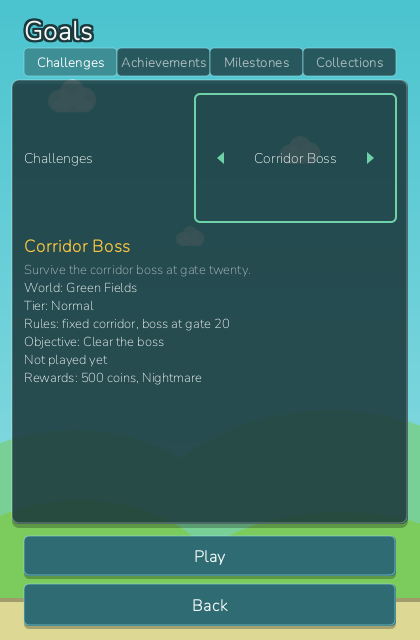

_Language:_ **English** · [[Português (Brasil)|Desafios-e-Metas-(pt-BR)]]

# Challenges and Goals

Beyond the high score, Flapforge gives every run a structured target: seven challenges, 41
achievements, milestone bars and collection percentages. They all live on one screen, the
**Goals** item of the [[Home Hub]]'s bottom navigation, and they all pay coins through the same
wallet as a normal run (see [[Shop and Upgrades]]).

*The Goals screen on its first tab: the seven challenges, the selected one's detail block and its
Play button.*

## The Goals screen

The screen has four tabs, stepped with the arrow keys or clicked directly:

| Tab | What it shows |
| --- | --- |
| **Challenges** | the seven challenges in content order, with a detail block and a Play button |
| **Achievements** | all 41 achievements, unlocked ones with their date, hidden ones as `???` |
| **Milestones** | the level bar, then the five nearest thresholds with a progress bar each |
| **Collections** | one bar per content category: how much of it you own, and a total |

Only the Challenges tab starts a run; the other three are read-only. The header of the
Achievements tab counts them ("12 of 41 unlocked").

## Challenges

A challenge is a self-contained run: the challenge fixes the world, the tier, the rules, any
forced modifier cards and, for one of them, its own boss. Everything else — your bird, its palette
and your loadout — comes from the profile. A challenge is playable **whether or not its world is
unlocked**: the world is a place, never a requirement, and three of the seven play in worlds a
fresh profile does not own. No modifier drafts are offered during a challenge.

The detail block names the world, the tier, the rules ("Standard rules" when there are none),
the objective in words, the rewards, and your record — "Not played yet", "Best 17 gates, 3
attempts" or "Completed". Locked challenges show their unlock condition instead.

| Id | Name | World | Tier | Rules | Objective | Unlocked by | First-clear reward |
| --- | --- | --- | --- | --- | --- | --- | --- |
| `no_shield_1` | No Shield I | Green Fields | Normal | `NO_DEFENSIVE_ABILITIES` | Survive 30 gates | Pass 20 gates in one run, or play 12 runs | 200 coins + Ember palette (Forgewing) |
| `speed_run_1` | Speed Run I | Wind Valley | Normal | `SPEED_RAMP`: the world keeps accelerating | Survive 30 gates | Pass 25 gates in one run, or play 15 runs | 250 coins + Comet palette (Zephyr) |
| `tiny_wings_1` | Tiny Wings I | Green Fields | Normal | `FLAP_VELOCITY` ×0.7, `classic` curve | Survive 20 gates | Pass 15 gates in one run, or play 10 runs | 150 coins |
| `moving_world_1` | Moving World I | Green Fields | Normal | `ALL_OBSTACLES_MOVE` | Survive 25 gates | Clear Green Fields, or pass 300 gates in total | 250 coins + Bronze palette (Ironbeak) |
| `one_life_1` | One Life I | Iron Forge | Normal | `NO_DEFENSIVE_ABILITIES`, `NO_REVIVE` | Survive 30 gates | Complete No Shield I, or play 25 runs | 400 coins + the Invulnerability ability |
| `coin_rush_1` | Coin Rush I | Wind Valley | Normal | `COIN_SPAWN_RATE` ×3, starts with Coin Drops | Collect 60 coins | Earn 1000 coins in total, or reach level 6 | 300 coins + Gilded palette (Jackdaw) |
| `boss_corridor_1` | Corridor Boss | Green Fields | Normal | fixed corridor (`corridor_1`), own boss at gate 20 | Clear the boss | Clear Green Fields, or reach level 12 | 500 coins + the Nightmare tier |

Notes on the table:

- "Clear Green Fields" means surviving the Green Fields world boss once (see
  [[Worlds and Bosses]]). Every condition is an *either/or*: the first branch you meet opens the
  challenge.
- The objective is judged every tick and latched the moment it is met — an "Objective complete"
  toast appears and the run simply continues, so you can keep flying for coins.
- The **first** completion pays the coins and the unlock listed above; every later completion
  pays only the 100-coin challenge bonus of the reward formula (see [[Playing a Run]]).
- The Corridor Boss is the challenge's *own* boss: it warns 120 ticks ahead of gate 20 and must
  be survived for 900 ticks (15 seconds). It is not a world boss, so it neither pays the world
  boss reward nor counts toward the boss achievements below.
- The four palettes are cosmetics for the named birds; Invulnerability joins the abilities you can
  equip; the Nightmare tier appears in the difficulty row (see [[Game Modes and Difficulty]]).

> **Tip:** the challenges are the cheapest way into Nightmare and into Invulnerability. Both
> `boss_corridor_1` and `one_life_1` have a purely time-based fallback (level 12, 25 runs), so a
> patient player reaches them without ever buying anything.

## Achievements

Achievements are judged automatically whenever a run finishes and whenever a purchase lands.
Each one is a single condition in one of three scopes — a lifetime counter, a record of the run
that just ended, or a collection percentage — and each fires exactly once, pays its coins and
shows a toast. Two are hidden: they are judged like any other, but the list shows `???` and "A
hidden achievement" until they fire, and they never get a milestone bar.

| Id | Name | Condition | Coins |
| --- | --- | --- | --- |
| `first_flight` | First Flight | Finish a run | 25 |
| `frequent_flyer` | Frequent Flyer | Finish 25 runs | 100 |
| `veteran` | Veteran | Finish 100 runs | 300 |
| `centurion` | Centurion | Finish 250 runs | 800 |
| `gates_10` | Ten Gates | Pass 10 gates in one run | 50 |
| `gates_25` | Twenty-Five Gates | Pass 25 gates in one run | 100 |
| `gates_50` | Fifty Gates | Pass 50 gates in one run | 250 |
| `gates_100` | A Hundred Gates | Pass 100 gates in one run | 600 |
| `marathon` | Marathon | Pass 1000 gates in total | 400 |
| `odyssey` | Odyssey | Pass 5000 gates in total | 1200 |
| `points_100` | Hundred Points | Score 100 points in one run | 50 |
| `points_500` | Five Hundred Points | Score 500 points in one run | 200 |
| `points_1000` | Thousand Points | Score 1000 points in one run | 500 |
| `coin_collector` | Coin Collector | Pick up 100 coins | 50 |
| `treasurer` | Treasurer | Earn 2000 coins | 200 |
| `tycoon` | Tycoon | Earn 10000 coins | 800 |
| `big_spender` | Big Spender | Spend 5000 coins | 500 |
| `clean_10` | Clean Ten | Reach a clean streak of 10 in one run | 100 |
| `clean_25` | Clean Twenty-Five | Reach a clean streak of 25 in one run | 300 |
| `first_save` | Saved | Have a shield absorb a hit | 50 |
| `ability_adept` | Ability Adept | Use abilities 50 times | 100 |
| `ability_master` | Ability Master | Use abilities 200 times | 400 |
| `boss_green_fields` | Field Marshal | Clear the Green Fields boss | 150 |
| `boss_wind_valley` | Windbreaker | Clear the Wind Valley boss | 200 |
| `boss_iron_forge` | Forgebreaker | Clear the Iron Forge boss | 250 |
| `boss_storm_sky` | Stormcaller | Clear the Storm Sky boss | 300 |
| `boss_void` | Void Walker (hidden) | Clear the Void boss | 400 |
| `boss_hunter` | Boss Hunter | Clear every world boss (all five) | 1000 |
| `first_challenge` | Challenger | Complete a challenge | 100 |
| `challenge_master` | Challenge Master | Complete every challenge (all seven) | 750 |
| `collect_all_birds` | Full Aviary | Unlock every bird | 500 |
| `collect_all_abilities` | Full Repertoire | Unlock every ability | 500 |
| `collect_all_worlds` | Cartographer | Unlock every world | 500 |
| `collect_all_cosmetics` | Full Wardrobe | Unlock every palette | 750 |
| `completionist` | Completionist (hidden) | Complete every collection | 2000 |
| `hard_10` | Hard Ten | Pass 10 gates on the Hard tier | 200 |
| `nightmare_10` | Nightmare Ten | Pass 10 gates on the Nightmare tier | 500 |
| `level_10` | Level Ten | Reach level 10 | 300 |
| `level_25` | Level Twenty-Five | Reach level 25 | 1000 |
| `daily_first` | Daily Flyer | Play a daily challenge | 50 |
| `daily_week` | Seven Days | Play seven daily challenges | 300 |

"In one run" conditions are records of the run that just finished, so they can only fire at a
run's end. "Clear" a boss means surviving a world's boss phase (see [[Worlds and Bosses]]);
"daily challenge" is the Daily mode of [[Game Modes and Difficulty]]. A prestige keeps every
achievement you hold and resets the challenge records.

## Milestones

The Milestones tab opens with your level bar, then lists "Next milestones": the five nearest
thresholds among the level rewards you have not claimed yet and the lifetime-threshold
achievements that have not fired, nearest first, each with a progress bar reading "current /
target". Per-run achievements report your best matching lifetime statistic (best streak, best
gates, best points), so the bar still moves between runs. When nothing is left the tab says
"Every milestone reached".

The level rewards are paid once, the first time you reach the level (the level cap is 50):

| Level | 2 | 5 | 10 | 15 | 20 | 25 |
| --- | --- | --- | --- | --- | --- | --- |
| Coins | 50 | 150 | 500 | 800 | 1200 | 2000 |

## Collections

The Collections tab draws one bar per content category, "owned / total (percent)", with the
percentage rounded down: **Birds** (7), **Abilities** (8), **Worlds** (5), **Challenges** (7),
**Colours** (the bird palettes), **Achievements** (41), **Upgrades** (the tree nodes) and,
last, **Everything**. The four "Full …" achievements above fire at 100 % of birds, abilities,
worlds and colours; the hidden Completionist fires when Everything reaches 100 %. The
[[Home Hub]]'s Profile header shows the short form, "Birds x/7 · Worlds x/5 · Achievements x/41".

## Toasts and the Next unlock card

Everything on this screen announces itself where it happens. The toasts you will see:

| Toast | When |
| --- | --- |
| "Achievement: *name* (+*n* coins)" | an achievement fired and paid its coins |
| "Unlocked: *name*" | an unlock was granted — by a challenge reward, an achievement, a boss clear or a threshold |
| "Challenge complete: *name*" | a challenge's first completion was recorded |
| "Objective complete" | mid-run, the moment a challenge objective is met |
| "Level *n*" | a level was reached (its reward, if any, arrives as coins) |

The **Next unlock** card on the hub always names the nearest measurable unlockable still to
earn: the non-cosmetic id you do not own whose closest branch is nearest to done, together with
its counter ("Pass 30 gates in one run", "17 / 30"). Earnable branches count before purchase-only
ones. Pressing the card opens the screen where that thing is earned: Birds, World Select, Forge,
Goals or the Shop. Once nothing measurable is left, the card reads "Everything unlocked".
