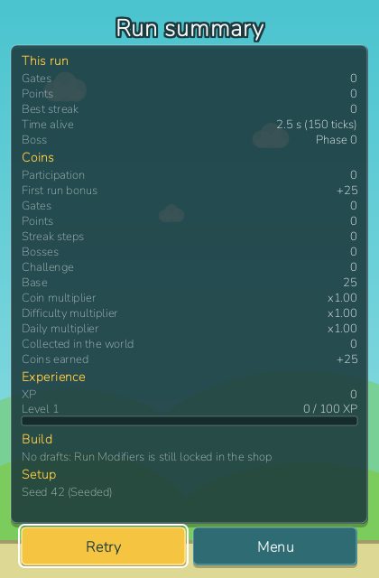

_Idioma:_ [[English|Playing-a-Run]] · **Português (Brasil)**

# Jogando uma partida

Uma partida é um voo: da primeira batida de asas até a queda, passando por portões, moedas,
escolhas de modificador e um chefe. Tudo o que você ganha nela — moedas, XP, desbloqueios,
recordes — é gravado no seu perfil no instante em que ela termina. Esta página percorre uma
partida de READY até o resumo e explica quanto vale cada número pelo caminho.

## O que INICIAR PARTIDA joga

A placa da tela inicial mostra o mundo e a dificuldade que o botão dourado **INICIAR PARTIDA**
vai jogar; a ave, a paleta, a habilidade ativa, as habilidades passivas, a dificuldade e o modo
(Padrão, Com semente, Diária) são escolhidos na tela Aves, e os desafios começam na tela Metas.
Veja [[Tela inicial|Tela-Inicial-(pt-BR)]], [[Aves e habilidades|Aves-e-Habilidades-(pt-BR)]],
[[Mundos e chefes|Mundos-e-Chefes-(pt-BR)]] e
[[Modos de jogo e dificuldade|Modos-de-Jogo-e-Dificuldade-(pt-BR)]]. Um perfil novo começa com
Asa-forjada (Forgewing), Batida Dupla (Double Flap), Campos Verdes (Green Fields) e a
dificuldade Normal.

## A forma de uma partida

`READY → FLYING ↔ {BREATHER → CHOOSING_MODIFIER → RESUME_HOLD} ↔ {BOSS_WARNING → BOSS} →
DYING → FINISHED`

| Fase | O que acontece |
| --- | --- |
| READY | O pássaro flutua na posição inicial; nada rola nem aparece. Sua primeira batida começa a partida e já conta nesse mesmo tick. |
| FLYING | O mundo rola, portões e perigos aparecem, moedas passam. Passe portões, colete moedas, mantenha uma sequência de portões limpos. |
| Respiro → escolha → espera de retomada | Nos portões 10, 25, 45, 70, 100 e 140 (com as escolhas desbloqueadas) o próximo obstáculo é empurrado para longe, o ar à frente esvazia e a partida congela com três cartas na tela. Leve uma ou pule; o pássaro fica parado durante uma contagem 3-2-1, e a retomada dá 30 ticks de invulnerabilidade para que o primeiro tick de volta nunca mate. |
| Aviso de chefe → chefe | Cada mundo tem um chefe num portão fixo. Uma faixa faz a contagem ("Chefe em Ns") enquanto nada mais aparece, e então o chefe emite seus padrões até o cronômetro de sobrevivência zerar. Morrer durante a luta não vence nada; uma vitória já concedida fica, mesmo que você caia depois. Nenhuma escolha abre durante um chefe — a que cair dentro dele espera até depois da vitória. |
| Morrendo → concluída | A queda, e então a faixa de fim de jogo. |

Toda partida é totalmente determinística para a sua semente: obstáculos, moedas, ofertas e
padrões vêm todos de fluxos aleatórios nomeados, então repetir uma semente põe os mesmos canos
nos mesmos lugares.

## Portões, pontos, moedas e sequências

- **Portões.** Todo portão de canos tem uma linha de pontuação; cruzá-la conta um portão e dá
  pontos iguais ao seu multiplicador de pontos — um ponto na base, mais com um modificador de
  pontos, um bônus da ave ou uma dificuldade. O HUD conta portões; o resumo mostra os dois.
- **Moedas.** Moedas aparecem pelo caminho e são coletadas ao toque; um raio de ímã (a passiva
  Ímã de Moedas (Coin Magnet), o modificador Rajada Magnética) as puxa de mais longe. As moedas
  que você pega entram no pagamento da partida por cima da fórmula de recompensa abaixo.
- **Sequência de portões limpos.** Um portão é limpo quando sua coluna nunca foi raspada, o que
  se resolve quando a coluna sai da hitbox do pássaro — então uma raspada depois da linha de
  pontuação ainda custa o portão em que aconteceu. Cada cinco portões limpos seguidos é uma
  etapa de sequência e paga 5 moedas; o HUD mostra "Sequência N", o resumo conta as etapas, e
  Melhor sequência é uma estatística permanente. O modificador Recompensa de Sequência soma
  +10 moedas por etapa.

## As rampas de dificuldade

Duas curvas se aplicam por portão passado. Campos Verdes usa a curva `classic`: só a rampa de
portões móveis, 5 % de chance de um portão móvel no começo, +5 % por portão, com teto em 100 %.
Todos os outros mundos usam `standard`: a mesma rampa móvel mais velocidade de rolagem ×(1 +
0,004 por portão) até ×1,5 e tamanho do vão ×(1 − 0,002 por portão) até ×0,8. A dificuldade
entra por cima:

| Dificuldade | Rolagem | Vão | Regras extras | Multiplicador de recompensa |
| --- | --- | --- | --- | --- |
| Normal | — | — | — | ×1,0 |
| Difícil | ×1,10 | ×0,92 | — | ×1,5 |
| Pesadelo | ×1,20 | ×0,85 | todo obstáculo se move, o teto mata | ×2,5 |

Os perigos, os mundos e o comportamento de cada chefe estão em
[[Mundos e chefes|Mundos-e-Chefes-(pt-BR)]].

## Pausar

`Esc` pausa. O painel de pausa tem **Continuar** e **Menu**; `Esc`, um clique ou um toque fora
dos botões continua. Nada se move enquanto está pausado, e a partida retoma exatamente de onde
parou.

## A faixa de fim de jogo

A faixa aparece sobre o campo de jogo congelado quando o pássaro morre. Ela paga na hora as
moedas e o XP da partida, anuncia um recorde novo ("É a sua melhor partida: N pontos"), um nível
alcançado ou um desafio concluído, e oferece três botões:

| Botão | Tecla | Faz |
| --- | --- | --- |
| **De novo** | `Space` / clique esquerdo / um toque fora dos botões | começa uma partida nova na hora, com uma semente nova |
| **Resumo** | `Enter` | abre o resumo da partida |
| **Menu** | `Esc` | volta à tela inicial |

Como as recompensas são creditadas no instante em que a partida termina, jogar de novo nunca as
perde. O De novo da Diária mantém a semente e só conta a tentativa.

## O resumo da partida


*O resumo da partida: cada termo da recompensa na sua própria linha, a barra de nível que o XP
moveu e a combinação (interface em inglês).*

O resumo lê o perfil em que a partida já foi gravada; ele não muda nada. Suas seções:

| Seção | Mostra |
| --- | --- |
| Configuração | a semente com o modo, o mundo, a dificuldade e a ave |
| Esta partida | portões, pontos, etapas de sequência, o chefe |
| Moedas | cada termo da fórmula de recompensa na sua própria linha, e o total |
| Experiência | o XP ganho, a barra de nível, "N / M XP" ou "Nível máximo" |
| Combinação | cada modificador levado com suas cópias (×N) e qualquer sinergia que disparou — ou "Sem escolhas: Modificadores de Partida ainda está bloqueado na loja" |
| Conquistas | conquistas desbloqueadas por esta partida e a primeira conclusão de um desafio |

**De novo** e **Menu** ficam embaixo, com as mesmas teclas da faixa.

## Moedas: a fórmula de recompensa

```
participação 20 · bônus de primeira partida 25 · 2 por portão · 1 por ponto
· 5 moedas por sequência limpa de 5 portões
+ 150 por chefe de mundo vencido + recompensa de primeira conclusão do desafio
+ 100 de bônus de desafio
× multiplicador de moedas × multiplicador da dificuldade × Diária ×1,25
  (+ as moedas que você pegou)
```

A partida 1 paga cerca de 50 moedas mesmo com 0 portões: 20 por participar, o bônus de primeira
partida de 25 e o que você pegou. O multiplicador de moedas vem da ave (Gralha (Jackdaw) +30 %,
Bico-de-ferro (Ironbeak) −20 %), de modificadores como Carteira Pesada ou Corrida do Ouro, da
sinergia Motor de Moedas e de +5 % por prestígio. Um chefe de mundo também paga a própria
recompensa (de 200 a 800 moedas) e abre o mundo seguinte.

## XP, níveis e marcos

XP nunca é gasto. Uma partida rende 15 XP por participar mais 10 por portão, e 200 por chefe
vencido. A curva de nível começa em 100 XP para o nível 2 e cada subida custa 10 % a mais que a
anterior — nível 3 em 210, nível 4 em 331 — até o máximo, nível 50. Seis níveis pagam uma
recompensa em moedas na hora:

| Nível | Recompensa do marco |
| --- | --- |
| 2 | 50 moedas |
| 5 | 150 moedas |
| 10 | 500 moedas |
| 15 | 800 moedas |
| 20 | 1200 moedas |
| 25 | 2000 moedas |

Os níveis também abrem conteúdo: Partidas com Semente e a Diária no nível 5, as três cartas de
modificador lendárias no nível 8, a dificuldade Pesadelo no nível 20 e o Prestígio no nível 25 —
veja [[Loja e melhorias|Loja-e-Melhorias-(pt-BR)]] e [[Desafios e metas|Desafios-e-Metas-(pt-BR)]].

> **Dica:** a faixa já pagou você antes de você lê-la. Jogue de novo com `Space` quantas vezes
> quiser; nada está em jogo além da próxima tentativa.
