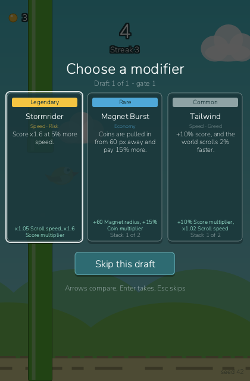

_Idioma:_ [[English|Modifiers-and-Synergies]] · **Português (Brasil)**

# Modificadores e sinergias

Os modificadores são a metade roguelite de uma partida: cartas escolhidas no meio do voo que
mudam as regras desta partida e só dela — mais pontos, mais moedas, uma hitbox menor, mais uma
carga de escudo, um mundo mais rápido. Leve duas que compartilhem uma etiqueta e uma sinergia de
conjunto dispara por cima. Tudo aqui desaparece quando a partida termina; as melhorias
permanentes estão em [[Loja e melhorias|Loja-e-Melhorias-(pt-BR)]].

## Desbloqueando as escolhas

As escolhas são o recurso **Modificadores de Partida** (`feature:modifiers`): ele abre depois de
7 partidas jogadas, ou antes por 150 moedas em Loja › Recursos. Até lá as partidas não têm
escolhas e a seção Combinação do resumo diz "Sem escolhas: Modificadores de Partida ainda está
bloqueado na loja". Um desafio pode desligar as escolhas na própria partida; a Diária sempre as
tem.

Catorze das dezessete cartas estão no baralho desde a sua primeira escolha. As três cartas
lendárias — Corrida do Ouro, Fênix e Cavaleiro da Tempestade — são ganhas no nível 8 ou compradas
na Loja por 300 moedas cada.

## Quando uma escolha abre

| Escolha | Portão |
| --- | --- |
| 1 | 10 |
| 2 | 25 |
| 3 | 45 |
| 4 | 70 |
| 5 | 100 |
| 6 | 140 |

Quando você passa um desses portões, o próximo obstáculo é empurrado para longe para abrir uma
janela limpa (o respiro), e assim que o ar à frente esvazia a partida congela e três cartas
sobem. As cartas são sorteadas sem reposição do fluxo aleatório `offers` da própria partida,
então, seja qual for a sua escolha, os obstáculos da partida continuam os mesmos. Uma escolha
nunca abre num tick que registrou uma colisão, nem enquanto um chefe está a caminho ou ativo: um
portão da agenda que cai dentro de um chefe espera até depois da vitória. Depois da sua resposta
o pássaro fica parado durante uma contagem 3-2-1 e ganha 30 ticks de invulnerabilidade na
retomada.

*Escolha 1 de 6 no portão 10: três cartas, a cópia que cada uma seria e a sinergia que uma carta
completaria (interface em inglês).*

## Lendo uma carta

Cada carta mostra o nome, a raridade (com cor e palavra próprias), as etiquetas, o efeito em
palavras e o mesmo efeito em números, a cópia que ela seria ("Cópia 1 de 2") e — quando levá-la
completaria um bônus de conjunto — "Completa Motor de Moedas" ou similar. Setas comparam, `Enter`
leva, `Esc` pula, exatamente como diz a dica embaixo das cartas; o mouse e o toque funcionam nas
cartas e no botão **Pular esta escolha** também. Enquanto as cartas estão na tela, nenhuma
batida, habilidade ou pausa chega à partida.

## Raridade, cópias e exclusões

| Raridade | Peso | Cartas |
| --- | --- | --- |
| Comum | 60 | 5 |
| Raro | 28 | 4 |
| Épico | 10 | 5 |
| Lendário | 2 | 3 |

Os pesos valem por sorteio, então uma comum é trinta vezes mais provável que uma lendária; medido
em 5000 escolhas amostradas, uma lendária aparece em 1,5 % das mesas.

- **Cópias.** Cada carta tem um limite de cópias; levá-la de novo soma uma cópia até esse limite,
  e uma carta no limite não é mais oferecida.
- **Exclusões.** Ar Pesado e Cavaleiro da Tempestade se excluem, assim como Estrutura Leve e Asas
  de Vidro: quando você tem uma, a outra sai do baralho.
- **Regras.** Uma carta cujo efeito as regras da partida anulariam não é oferecida: Escudo de
  Campo exige habilidades defensivas permitidas, Segundo Fôlego e Fênix exigem ressurreições
  permitidas, e as cartas de moedas (Chuva de Moedas, Rajada Magnética, Recompensa de Sequência)
  exigem moedas permitidas. Uma escolha sem nada elegível é pulada direto, sem congelar a
  partida.

## Os dezessete modificadores

| Id | Nome | Raridade | Etiquetas | Efeito | Máx. de cópias |
| --- | --- | --- | --- | --- | --- |
| `tailwind` | Vento a Favor | Comum | Velocidade, Ganância | +10% de pontos, e o mundo corre 2% mais rápido. | 2 |
| `score_plus` | Olho Afiado | Comum | Ganância | +10% de pontos. | 3 |
| `coin_drops` | Chuva de Moedas | Comum | Economia | +0,15 moeda por cano. | 3 |
| `slower_obstacles` | Ar Pesado | Comum | Ritmo | O mundo corre 8% mais devagar. | 2 |
| `quick_hands` | Mãos Rápidas | Comum | Ritmo | Recargas de habilidade 15% mais curtas. | 2 |
| `light_frame` | Estrutura Leve | Raro | Precisão | Hitbox menor: -0,08 de escala. | 2 |
| `streak_bounty` | Recompensa de Sequência | Raro | Economia, Precisão | +10 moedas por etapa de sequência limpa. | 1 |
| `magnet_burst` | Rajada Magnética | Raro | Economia | Moedas são atraídas a 60 px de distância e pagam 15% a mais. | 2 |
| `wide_gaps` | Vãos Largos | Raro | Precisão | Vãos 8% mais altos. | 2 |
| `temp_shield` | Escudo de Campo | Épico | Defesa | Mais uma carga de escudo nesta partida. | 1 |
| `heavy_wallet` | Carteira Pesada | Épico | Economia, Ganância | Moedas pagam 30% a mais, e o pássaro cai 8% mais forte. | 1 |
| `glass_wings` | Asas de Vidro | Épico | Risco, Ganância | Pontos x1,5, e hitbox 0,15 maior. | 1 |
| `second_wind` | Segundo Fôlego | Épico | Defesa | Uma ressurreição nesta partida. | 1 |
| `long_fuse` | Pavio Longo | Épico | Ritmo | Habilidades duram 30% mais. | 1 |
| `gold_rush` | Corrida do Ouro | Lendário | Economia, Risco | Moedas pagam o dobro, e o mundo corre 5% mais rápido. | 1 |
| `phoenix` | Fênix | Lendário | Defesa, Risco | Duas ressurreições, mas as moedas pagam 30% a menos. | 1 |
| `stormrider` | Cavaleiro da Tempestade | Lendário | Velocidade, Risco | Pontos x1,6 com 5% mais velocidade. | 1 |

As etiquetas são a única coisa que as sinergias leem; Ganância e Ritmo não têm sinergia própria.

## Cartas forçadas

Algumas partidas começam com cartas já levadas. Elas são entradas como qualquer outra — aparecem
no HUD, contam para as sinergias e entram na seção Combinação do resumo — e são levadas antes do
primeiro tick, então não gastam uma escolha.

- **Diária.** Dois modificadores forçados compatíveis, sorteados de forma determinística a partir
  do conteúdo que você já desbloqueou e congelados para a data.
- **Desafios.** Corrida do Ouro I força Chuva de Moedas além da sua taxa de moedas ×3; os outros
  desafios impõem regras (e, no Chefe do Corredor, um padrão forçado) em vez de cartas. Veja
  [[Desafios e metas|Desafios-e-Metas-(pt-BR)]] e
  [[Modos de jogo e dificuldade|Modos-de-Jogo-e-Dificuldade-(pt-BR)]].

## Sinergias

Uma sinergia é um bônus de conjunto: ela ativa quando duas cartas levadas *distintas* cobrem
juntas as etiquetas que ela exige, então uma carta sozinha nunca completa uma — duas cópias de
Chuva de Moedas não fazem um Motor de Moedas; Chuva de Moedas mais Rajada Magnética fazem.

| Id | Nome | Exige | Efeito |
| --- | --- | --- | --- |
| `coin_engine` | Motor de Moedas | Economia + Economia | Duas cartas de economia: +25% de moedas. |
| `bulwark` | Baluarte | Defesa + Defesa | Duas cartas de defesa: mais uma carga de escudo. |
| `needle_threader` | Fio da Agulha | Precisão + Precisão | Duas cartas de precisão: −0,10 de escala de hitbox. |
| `daredevil` | Destemido | Velocidade + Risco | Velocidade e risco juntos: +35% de pontos. |

A escolha avisa quando uma carta completaria uma, o resumo lista as sinergias que dispararam, e
"Sinergias ativadas" é uma estatística permanente no Perfil. Um bot que chega à terceira escolha
ativa uma sinergia em 69,9 % das partidas, então mirar numa não é um tiro no escuro.

Alguns pares para buscar:

| Leve | Depois | Resultado |
| --- | --- | --- |
| Chuva de Moedas | Rajada Magnética, Recompensa de Sequência, Carteira Pesada ou Corrida do Ouro | Motor de Moedas |
| Estrutura Leve | Vãos Largos ou Recompensa de Sequência | Fio da Agulha |
| Escudo de Campo | Segundo Fôlego ou Fênix | Baluarte |
| Vento a Favor ou Cavaleiro da Tempestade | Asas de Vidro, Corrida do Ouro ou Fênix | Destemido |

Cavaleiro da Tempestade traz Velocidade e Risco, mas sozinho não completa nada: as duas etiquetas
precisam vir de duas cartas diferentes.

## Pulando uma escolha

Pular é sempre permitido: `Esc` ou o botão **Pular esta escolha** não leva nada, a contagem roda
e a partida segue. A escolha é consumida — ela não volta depois — e o resumo simplesmente lista
menos cartas. Pule quando toda carta na mesa atrapalharia a combinação que você está voando:
Asas de Vidro numa combinação de precisão, ou Corrida do Ouro e sua velocidade extra num mundo
em que você mal sobrevive.

> **Dica:** a carta que completa uma sinergia costuma valer mais que uma carta mais rara que não
> completa — a carga de escudo extra de Baluarte ou a hitbox −0,10 de Fio da Agulha é o efeito de
> uma carta inteira de graça.
