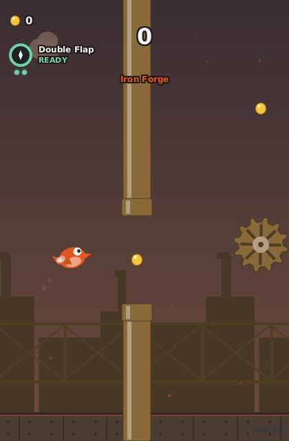
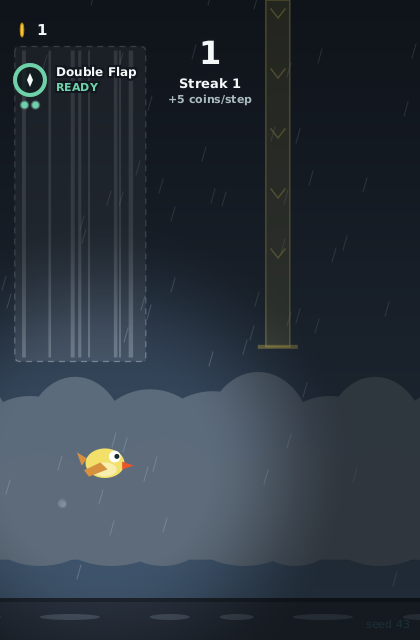
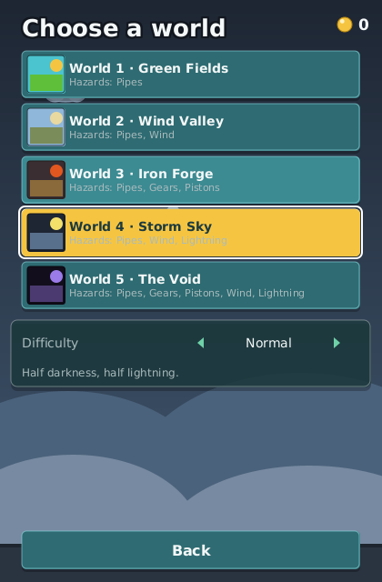

_Idioma:_ [[English|Worlds-and-Bosses]] · **Português (Brasil)**

# Mundos e chefes

O Flapforge tem cinco mundos. Cada um traz a própria paleta, a própria mistura de perigos, a
própria curva de dificuldade e a própria música, além de um chefe esperando num portão fixo.
Vencer esse chefe abre o mundo seguinte; comprar o mundo seguinte na Loja é o outro caminho, e
por isso ninguém fica preso na progressão. O mundo da próxima partida é escolhido na tela
Escolha um mundo, atrás da placa da [[Tela inicial|Tela-Inicial-(pt-BR)]].

## Os cinco mundos

| # | `id` | Nome | Estilo | Mistura de perigos (pesos) | Efeitos do mundo inteiro | Chefe: portão / sobreviver / recompensa da primeira vitória |
| --- | --- | --- | --- | --- | --- | --- |
| 1 | `green_fields` | Campos Verdes (Green Fields) | colinas | Canos 100 | a curva clássica: só a rampa de canos móveis | 30 / 1200 ticks / 200 moedas, abre o Vale do Vento |
| 2 | `wind_valley` | Vale do Vento (Wind Valley) | desfiladeiro | Canos 60, Vento 40 | um vento contrário constante de −20 px/s | 30 / 1500 ticks / 300 moedas, abre a Forja de Ferro e a árvore de melhorias Forja |
| 3 | `iron_forge` | Forja de Ferro (Iron Forge) | fábrica | Canos 40, Engrenagens 30, Pistões 30 | velocidade do mundo ×1,1 | 30 / 1800 ticks / 400 moedas, abre o Céu de Tempestade |
| 4 | `storm_sky` | Céu de Tempestade (Storm Sky) | tempestade | Canos 55, Relâmpagos 25, Vento 20 | velocidade do mundo ×1,15, escuridão 0,5, um clarão no céu a cada 3 portões | 35 / 1800 ticks / 500 moedas, abre O Vazio |
| 5 | `void` | O Vazio (The Void) | vazio | Canos 40, Engrenagens 20, Pistões 20, Vento 10, Relâmpagos 10 | as regras mudam a cada 5 portões | 40 / 2100 ticks / 800 moedas, concede a paleta Vidro do Vazio |

Nas palavras do próprio jogo (`world.<id>.desc`):

* **Campos Verdes** — "Céu aberto e canos constantes. Onde toda partida começa."
* **Vale do Vento** — "Um desfiladeiro que empurra de volta, cano após cano."
* **Forja de Ferro** — "Engrenagens e pistões, e tudo dez por cento mais rápido."
* **Céu de Tempestade** — "Metade escuridão, metade relâmpago."
* **O Vazio** — "As próprias regras mudam a cada poucos canos."

Campos Verdes usa a curva de dificuldade `classic`: a chance de um portão móvel começa em 5% e
cresce 5% por portão passado, até 100%, e nada mais muda. Todos os outros mundos usam a curva
`standard`, que soma velocidade do mundo ×(1 + 0,004 por portão) até ×1,5 e tamanho do vão
×(1 − 0,002 por portão) até ×0,8. O nível de dificuldade se empilha sobre a curva; veja
[[Modos de jogo e dificuldade|Modos-de-Jogo-e-Dificuldade-(pt-BR)]].

## As famílias de obstáculos

Os obstáculos vêm em cinco famílias. Os canos aparecem em todos os mundos; as outras quatro são
os perigos que cada mundo mistura, nas proporções da tabela acima. Os nomes são os que a linha
Mundo e a tela Escolha um mundo mostram em "Perigos".

| Família | `id` | O que faz |
| --- | --- | --- |
| Canos | `pipe_gate` | O portão que todo mundo gera: um par fixo ou flutuante, com um oscilador opcional que o faz mover |
| Engrenagens | `gear` | Círculos que giram, alguns sobre um trilho vertical |
| Pistões | `piston` | Um aviso, depois estende, segura e recolhe: o aviso é a sua deixa |
| Vento | `wind_zone` | Uma força constante que entorta a sua trajetória; nunca é letal por si só |
| Relâmpagos | `lightning` | Um raio de altura parcial, com uma faixa segura garantida e um aviso antes do golpe |

*Forja de Ferro: engrenagens e uma fileira de pistões entre os canos, dez por cento mais rápido
que Campos Verdes (interface em inglês).*

Cada mundo também sorteia trechos autorais: a corrente ascendente e o vento cruzado do Vale do
Vento, o corredor de engrenagens e a fileira de pistões da Forja de Ferro, a pista de raios e a
rajada do Céu de Tempestade, e o misturador e o corredor de provas do Vazio. Todo trecho é
verificado como superável em pelo menos 30% das sementes pelo bot especialista do jogo, então
nenhum deles é morte certa.

## Os ciclos de regras do Vazio

A cada 5 portões, o Vazio troca as regras. Uma faixa **Mudança de regra** faz uma contagem de 90
ticks ("… em …s", depois "… agora", depois "… em vigor") antes que uma de quatro regras assuma:

| Mudança de regra | Efeito |
| --- | --- |
| Todos os obstáculos se movem | a flag `ALL_OBSTACLES_MOVE` |
| Vãos mais estreitos | tamanho do vão ×0,85 |
| Gravidade mais pesada | gravidade ×1,3 |
| Teto letal | a flag `LETHAL_CEILING`: encostar no topo da tela mata |

A mesma opção nunca é sorteada duas vezes seguidas, então a regra que você acabou de sobreviver
fica fora da próxima mudança.

## Os relâmpagos do Céu de Tempestade

O Céu de Tempestade é escuro (escuridão ambiente 0,5) e ilumina o céu a cada 3 portões. Esse
clarão, com o trovão, é só visual: não tem hitbox. Os raios que matam são gerados como
obstáculos, no Céu de Tempestade e, mais raramente, no Vazio:

* Um raio desce do topo ou sobe do chão da tela e cobre de 40 a 60% da altura do campo, então
  sempre sobra uma faixa segura do outro lado.
* Um marcador de aviso mostra o lado e a extensão do raio 45 ticks (três quartos de segundo)
  antes do golpe; ele é visível desde o primeiro tick e fica mais forte conforme o golpe se
  aproxima.
* O golpe em si dura de 10 a 12 ticks. Esteja na faixa segura quando ele cair.

*Céu de Tempestade: a faixa de aviso marca onde o raio vai cair; o resto da coluna é seguro
(interface em inglês).*

> **Dica:** a opção Reduzir flashes em
> [[Configurações e acessibilidade|Configuracoes-e-Acessibilidade-(pt-BR)]] suaviza o brilho dos
> relâmpagos sem mudar onde os raios caem.

## Chefes

Todo mundo termina num confronto com o chefe no seu portão de chefe (30, 30, 30, 35 e 40). O HUD
avisa 120 ticks antes (150 no Vazio) com "Chefe em …s" e depois faz a contagem da luta com
"CHEFE …s", enquanto o mundo despeja os padrões autorais do chefe: dois por mundo, três no Vazio.
Sobreviva à contagem inteira (de 1200 a 2100 ticks, ou seja, de 20 a 35 segundos) e a faixa
anuncia "… vencido!". A música passa a uma variante mais rápida do loop do mundo enquanto a luta
dura, 15% mais rápida e limitada a 170 BPM.

* **A primeira vitória** concede a recompensa de chefe da tabela acima: as moedas e o mundo
  seguinte, mais a árvore de melhorias Forja depois do Vale do Vento e a paleta Vidro do Vazio da
  Asa-forjada (Forgewing) depois do Vazio. Ela é registrada como `world_cleared`, que outros
  desbloqueios também leem: a Brasa (Cinder), os desafios Mundo em Movimento I e Chefe do
  Corredor e a árvore Forja abrem com uma vitória em Campos Verdes ou no Vale do Vento.
* **Toda vitória** também paga o bônus de chefe da partida, 150 moedas e 200 XP, listado no resumo
  da partida em Chefes, e conclui uma das conquistas de chefe (Marechal dos Campos, Quebra-vento,
  Quebra-forja, Chama-tempestade, Andarilho do Vazio e Caçador de Chefes pelos cinco). Veja
  [[Desafios e metas|Desafios-e-Metas-(pt-BR)]].
* Só o chefe de um **mundo** conta. O desafio Chefe do Corredor repete o próprio padrão de chefe
  e paga a própria recompensa, mas nunca vence um mundo.

## Desbloqueando um mundo

Campos Verdes é seu desde o início. Cada um dos outros mundos abre ou vencendo o chefe do mundo
anterior ou comprando-o na aba Mundos da Loja ([[Loja e melhorias|Loja-e-Melhorias-(pt-BR)]]):

| Mundo | Conquiste com | Ou compre por |
| --- | --- | --- |
| Vale do Vento | vencer o chefe de Campos Verdes | 350 moedas |
| Forja de Ferro | vencer o chefe do Vale do Vento | 700 moedas |
| Céu de Tempestade | vencer o chefe da Forja de Ferro | 1200 moedas |
| O Vazio | vencer o chefe do Céu de Tempestade | 2000 moedas |

Um desafio é sempre jogado no próprio mundo, adquirido ou não, então os sete desafios da tela
Metas podem levar você ao Vale do Vento ou à Forja de Ferro antes de você possuí-los.

## A tela Escolha um mundo

*Escolha um mundo: um cartão por mundo, a linha Dificuldade sob os cartões e a linha de descrição
(interface em inglês).*

A placa da tela inicial ("Mundo 1 · Campos Verdes") abre a tela **Escolha um mundo**:

* Um cartão por mundo, em ordem, com a paleta do mundo como arte. Um cartão adquirido lista os
  perigos que o mundo gera; um bloqueado mostra o caminho mais barato como subtítulo e o preço
  como distintivo.
* Ativar um cartão adquirido grava a sua seleção e leva você direto de volta à tela inicial, cuja
  placa, cujo fundo e cujo subtítulo de INICIAR PARTIDA acompanham a mudança.
* Ativar um cartão bloqueado é recusado com um aviso ("Compra recusada: Bloqueado"): mundos são
  comprados na Loja, não aqui.
* A linha **Dificuldade** sob os cartões alterna entre Normal, Difícil e Pesadelo, com os níveis
  bloqueados marcados; passar para um nível bloqueado faz a linha voltar, com o mesmo aviso.
* Uma linha de descrição sob a linha Dificuldade descreve o mundo em foco.

A linha Mundo da tela Aves faz o mesmo trabalho do outro lado da tela inicial
([[Aves e habilidades|Aves-e-Habilidades-(pt-BR)]]).

## Escolhendo um mundo pela linha de comando

No desktop, `--world <id>` seleciona um mundo adquirido para uma execução, exatamente como o
seletor faria: `green_fields`, `wind_valley`, `iron_forge`, `storm_sky` ou `void`. A seleção é
gravada no perfil, então a placa da tela inicial e INICIAR PARTIDA jogam nele. Um mundo bloqueado
não pode ser selecionado: a tela inicial mantém a seleção adquirida e uma linha no log avisa (só
um `--headless-run` joga o mundo da flag mesmo assim). `--tier <id>` escolhe a dificuldade do
mesmo jeito. Veja [[Primeiros passos|Primeiros-Passos-(pt-BR)]].

## Música

Cada mundo toca o próprio loop chiptune gerado proceduralmente: uma sequência determinística de
oito compassos, criada no início da partida a partir do bloco de música do mundo e trocada por uma
variante mais rápida enquanto a luta contra o chefe dura. O menu toca o loop de Campos Verdes.
Nenhum arquivo de áudio acompanha o jogo; o sequenciador, o sintetizador e o mixer por software
geram tudo.

| Mundo | Andamento | Escala | Camadas |
| --- | --- | --- | --- |
| Campos Verdes | 112 BPM | pentatônica maior | baixo, melodia, bateria |
| Vale do Vento | 96 BPM | dórica | baixo, melodia, arpejo, pad |
| Forja de Ferro | 126 BPM | frígia | baixo, melodia, bateria |
| Céu de Tempestade | 134 BPM | pentatônica menor | baixo, melodia, arpejo, bateria |
| O Vazio | 104 BPM | tons inteiros | baixo, pad, arpejo |
