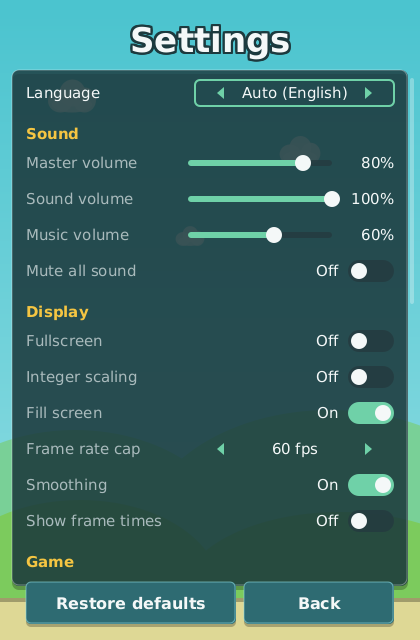

_Language:_ **English** · [[Português (Brasil)|Configuracoes-e-Acessibilidade-(pt-BR)]]

# Settings and Accessibility

The Settings screen opens from the gear icon at the top of the [[Home Hub]]. Every row applies
**live** — there is no Apply button and nothing needs a restart — and every change is written to
`settings.json` at once, so the game starts the way you left it. The rows are longer than the
screen, so the list scrolls; the two buttons you must always be able to reach, **Restore
defaults** and **Back**, sit in a fixed footer bar instead.

*The Settings screen: the language row, then the Sound, Display, Game, Controls and About
sections, with Restore defaults and Back fixed at the bottom.*

## Language

The first row is **Language** with three options: **Auto**, which follows the system locale and
shows what it resolved to ("Auto (English)"), **English** and **Portuguese (Brazil)**. The switch
is immediate: the toast "Language: …" confirms it and the hub behind the screen re-labels itself.
The `--lang en` / `--lang pt_BR` launch flag overrides this row for one launch only (see
[[Getting Started]]).

## Sound

| Row | Default | Notes |
| --- | --- | --- |
| Master volume | 80 % | gain applied to every voice |
| Sound volume | 100 % | sound effects |
| Music volume | 60 % | the per-world chiptune loop |
| Mute all sound | off | the same switch the `M` key flips on every screen |

All audio is synthesised at run time; there are no audio files to install. If no sound device
can be opened the game plays exactly the same, silently (see the `--no-audio` flag in the [[FAQ]]).

## Display

| Row | Default | What it does |
| --- | --- | --- |
| Fullscreen | off | borderless fullscreen; `F11` toggles it on every screen |
| Integer scaling | off | snaps the 420×640 playfield to whole-pixel scales (1×, 2×, 3× …) instead of stretching to the window |
| Fill screen | on | on windows taller than 420:640 the renderers paint sky and earth over what would be letterbox bars; purely cosmetic, gameplay stays inside the playfield |
| Frame rate cap | 60 fps | 60 fps, 120 fps, 144 fps, Uncapped or Match refresh rate; the simulation always runs at 60 Hz, the cap only paces rendering |
| Smoothing | on | allows bilinear smoothing when the scale is not a whole number |
| Show frame times | off | the debug overlay (tick rate, frame time, seed) that `F3` toggles |

## Game

| Row | Default | What it does |
| --- | --- | --- |
| High contrast | off | stronger hazard and bird outlines, opaque HUD panels and a cap on world darkness, so veiled worlds stay readable |
| Colour-blind palette | None | Protanopia, Deuteranopia or Tritanopia re-tint every world palette and the semantic colours (danger telegraphs, coins, flames) while keeping hazard, telegraph and coin luminance apart |
| Reduce flashing | on | honoured by lightning, telegraphs and particles; also caps the START RUN glow on the hub |
| Text size | 1.00 | a slider from 0.75 to 1.50 in steps of 0.05; every screen reflows |
| Hold to flap | off | holding the flap input flaps continuously (every 24 ticks) instead of once per press |

These five, plus the key bindings and the sound rows, are the accessibility settings. They are
all live and all persisted, so a colour-blind palette or a larger text size set once stays set.

## Controls

The Controls section has one row per rebindable action, showing its current keys:

| Action | Default keys |
| --- | --- |
| Flap | `Space`, `Up` (left mouse button, always) |
| Ability | `X`, `Shift` (right mouse button, always) |
| Pause | `Esc` |
| Confirm | `Enter` |
| Mute | `M` |
| Debug overlay | `F3` |
| Fullscreen | `F11` |

Press a row and the screen asks "Press a key, or Esc to cancel"; the next key pressed becomes the
binding, and a toast confirms it ("Flap: F"). A key that another action already uses is refused
with "*key* is already used by *action*". The arrow keys, `Esc`-to-go-back and the mouse buttons
are fixed and cannot be rebound. The full list of what each key does is on [[Controls]].

## About

The last section is informational: the game version (`v0.2.2`), the Java runtime it is running
on ("Java 17" and so on) and a reminder of the global keys, "F3 debug   F11 fullscreen". On the
desktop it also carries the **Quit** row — the other way out of the game besides pressing `Esc`
twice on the hub. On Android the row does not exist; the app is left through the system's own
Back gesture.

## Global keys

`M` (mute), `F3` (debug overlay) and `F11` (fullscreen) work on every screen, including inside a
run. They are not engine switches: each one flips the matching row of this screen and saves it,
so the Settings screen always shows what is actually in force and the state survives a restart.

## Restore defaults

The footer's **Restore defaults** returns every row — language, volumes, display, game options
and key bindings — to the values in the tables above, applies them at once and confirms with
"Settings restored to their defaults".

## The settings file

Settings live in `settings.json` inside the profile directory, next to the save:

| OS | Profile directory |
| --- | --- |
| Linux / BSD | `~/.flapforge` |
| Windows | `%APPDATA%\Flapforge` |
| macOS | `~/Library/Application Support/Flapforge` |

The directory can be moved with the `--home DIR` flag, the `flapforge.home` system property or
the `FLAPFORGE_HOME` environment variable, in that order of precedence. Every write is crash-safe:
the file is written to a temporary name, flushed and renamed atomically.

The file carries a `version` field (currently `1`). A `settings.json` whose version differs from
the build's is **not loaded**: the defaults are restored and the old file is kept beside it as
`settings.v<N>.json` (`settings.v<N>-2.json`, `-3` … when one already exists), with a warning
toast naming the file. A file with no `version` key at all is treated as a missing key rather
than a mismatch, so a hand-edited file keeps its values. `keyBindings` holds exactly the seven
rebindable actions; the focus arrows and Back are never written.

> **Tip:** if a setting is not remembered between launches, check that the profile directory is
> writable — a failed write raises a "Could not save" toast rather than crashing the game.
