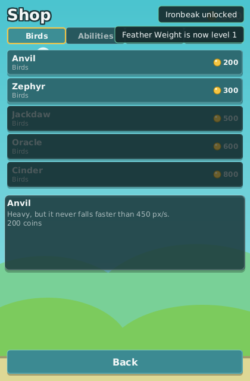
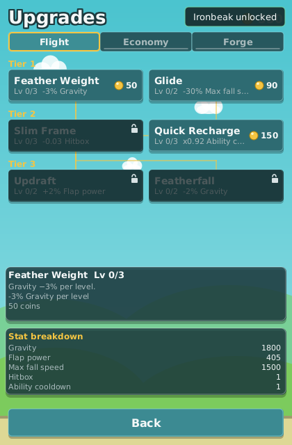

_Language:_ **English** · [[Português (Brasil)|Loja-e-Melhorias-(pt-BR)]]

# Shop and Upgrades

Every run ends with coins and XP. Coins are what you spend, in two places: the **Shop** (birds,
abilities, worlds and features) and the three upgrade trees behind the hub's **Forge** item, on a
screen titled **Upgrades**. This page lists everything they sell, what it costs, why a purchase
can be refused, and how the forge on the [[Home Hub]] grows as you buy.

## Coins and XP

**Coins** are the only currency. A run pays them by a fixed formula, listed line by line on the
run summary ([[Playing a Run]]):

| Line | Coins |
| --- | --- |
| Participation | 20 per finished run |
| First run bonus | 25, once per profile |
| Gates | 2 per gate passed |
| Points | 1 per point scored |
| Streak steps | 5 per step of the clean-gate streak, one step every 5 gates |
| Bosses | 150 per boss cleared |
| Challenge | 100 for a challenge objective met |

That base is multiplied by your coin multiplier (bird, upgrade nodes, cards and prestige), by the
difficulty multiplier of the tier (×1.0, ×1.5 or ×2.5) and, on a daily, by ×1.25; the coins you
picked up in the world are added on top. Rewards are banked the moment a run ends, so an instant
retry never loses them.

**XP** is never spent. A run pays 15 XP for taking part, 10 per gate and 200 per boss cleared;
level 2 needs 100 XP, every level needs 10 % more than the one before, and the ladder stops at
level 50. Levels are unlock conditions in their own right (Slow Time at 4, Seeded Runs at 5, the
legendary cards at 8, Nightmare at 20, prestige at 25) and some of them pay coins: 50 at level 2,
150 at 5, 500 at 10, 800 at 15, 1200 at 20 and 2000 at 25, listed on the Milestones tab of the
Goals screen ([[Challenges and Goals]]). The Scholar node is the one thing that raises XP.

## What the Shop sells

*The Shop: four tabs, the cheapest offer first, the price on every card and the wallet on top.*

The Shop opens from the hub's **Shop** item or from its coin chip. It lists everything that has a
price and that you do not own yet, in four tabs, cheapest first, and every card says whether
your wallet covers it. Everything sold here can also be earned, so the Shop is a shortcut, never
the only road: the earn conditions are on [[Birds and Abilities]], [[Worlds and Bosses]] and
[[Game Modes and Difficulty]], and the hub's **Next unlock** card always names the nearest one.

| Tab | What it lists | Prices |
| --- | --- | --- |
| Birds | the birds you do not own yet | Ironbeak 150, Anvil 200, Zephyr 300, Jackdaw 500, Oracle 600, Cinder 800 |
| Abilities | the abilities you do not own, and the next level of the ones you do | Coin Magnet 120, Shield 200, Dash 250, Slow Time 350, Emergency Recovery 400, Score Multiplier 450, Invulnerability 700; level 2 costs twice the price and level 3 four times |
| Worlds | the worlds you do not own (tiers and challenges belong to this tab too, but carry no price: they are earned only) | Wind Valley 350, Iron Forge 700, Storm Sky 1200, The Void 2000 |
| Features | the upgrade trees, the two features and the three legendary modifier cards | Seeded Runs 100, the Economy tree 120, Run Modifiers 150, Gold Rush, Phoenix and Stormrider 300 each, the Forge tree 900 |

An ability card shows "Next level 2" and the cap it is under ("Level cap 2"); at the cap it reads
"Cap reached", and at level 3 "Fully upgraded". The cap starts at 2 and only the Master Forge node
raises it to 3 (see [[Birds and Abilities]]). A tab with nothing left to sell says "Nothing left
to buy here".

> **Tip:** the Shop lists Ironbeak at 150 coins and Seeded Runs at 100. With the first-run bonus
> and a few gates, both are within reach on your first evening; the example progression below
> shows the order most players fall into.

## Refusals

A purchase either succeeds whole or does nothing, and a toast says which. On success the wallet
is debited, the thing is granted and the profile is saved at once: "Ironbeak unlocked", or "Shield
is now level 2". A refusal reads "Purchase refused: …" with the reason after the colon:

| Reason | In the Shop | On the Upgrades screen |
| --- | --- | --- |
| Not enough coins | the wallet is short; the card already shows it cannot be covered | the same |
| Owned | you already own it | "Already unlocked" (see below) |
| Cap reached | the ability sits at the current level cap | — |
| Fully upgraded | the ability is at level 3 | "Maxed" |
| Locked | the id is not for sale, such as a level of an ability you do not own yet | "Tree locked: …" while the tree is closed, "Needs …" for a missing prerequisite |

Nothing is debited on a refusal, and a purchase never touches a run already in progress: buying a
node mid-session changes the next run, not the current one.

## The upgrade trees

*The Upgrades screen: one tab per tree, nodes laid out by tier, a line from every prerequisite.*

The hub's **Forge** item opens the screen titled **Upgrades**: one tab per tree, the nodes laid
out by tier with a line drawn from every prerequisite, and on each card the name, the level
("Lv 1/3"), what one level does in words ("−3% Gravity per level"), the price of the next level
and its state: the tree's own condition while the tree is locked, "Needs Feather Weight" for a
missing prerequisite, the price when it is buyable, "Maxed" at the top, or "Already unlocked". A
tooltip repeats the detail of the focused node.

Nodes are bought level by level. A flat or percentage effect grows linearly with the level; a
multiplying effect compounds (Quick Recharge at level 3 is ×0.92 three times over). The three
trees hold 18 nodes and 43 levels in total.

| Tree | `id` | Opens with | Or buy for |
| --- | --- | --- | --- |
| Flight | `flight` | available from the start | — |
| Economy | `economy` | reaching level 3 | 120 coins |
| Forge | `forge` | clearing the Wind Valley boss | 900 coins |

### Flight: "Gravity, fall speed and hitbox: how the bird flies"

| Node | `id` | Tier | Levels | Costs | Per level | Needs |
| --- | --- | --- | --- | --- | --- | --- |
| Feather Weight | `feather_1` | 1 | 3 | 50 / 120 / 250 | gravity −3 % | — |
| Glide | `glide_1` | 1 | 2 | 90 / 200 | terminal fall speed −30 % at level 1 and −35 % at level 2 (the card still reads −25 % per level) | — |
| Slim Frame | `slim_frame_1` | 2 | 3 | 150 / 300 / 600 | hitbox −0.03 | Feather Weight |
| Quick Recharge | `quick_recharge_1` | 2 | 3 | 150 / 300 / 600 | ability cooldowns ×0.92 | — |
| Updraft | `updraft_1` | 3 | 2 | 400 / 800 | flap strength +2 % | Feather Weight and Glide |
| Featherfall | `featherfall_2` | 3 | 2 | 500 / 1000 | gravity −2 %, on top of Feather Weight | Slim Frame |

### Economy: "Coins, experience and magnets: what a run pays"

| Node | `id` | Tier | Levels | Costs | Per level | Needs |
| --- | --- | --- | --- | --- | --- | --- |
| Coin Purse | `coin_purse_1` | 1 | 4 | 80 / 160 / 320 / 640 | coins earned +5 % | — |
| Scholar | `scholar_1` | 1 | 4 | 80 / 160 / 320 / 640 | experience +5 % | — |
| Lodestone | `lodestone_1` | 1 | 3 | 150 / 300 / 600 | coin pickup radius +20 | — |
| Coin Rain | `coin_rain_1` | 2 | 3 | 120 / 240 / 480 | +0.10 expected coins per gate | Coin Purse |
| Trial by Fire | `hard_tier_1` | 2 | 1 | 400 | unlocks the Hard tier | Coin Purse |
| Ability Scholar | `ability_scholar_1` | 3 | 1 | 900 | one more passive ability slot | Scholar and Lodestone |

### Forge: "Shields, revives and ability power"

| Node | `id` | Tier | Levels | Costs | Per level | Needs |
| --- | --- | --- | --- | --- | --- | --- |
| Tempered Shield | `tempered_shield_1` | 1 | 2 | 500 / 1200 | start every run with one shield charge | — |
| Ability Forge | `ability_forge_1` | 1 | 3 | 300 / 600 / 1000 | ability duration +5 % | — |
| Cooldown Forge | `cooldown_forge_1` | 1 | 3 | 300 / 600 / 1000 | ability cooldowns ×0.93 | — |
| Honed Edge | `hitbox_forge_1` | 2 | 2 | 700 / 1400 | hitbox −0.05 | Tempered Shield |
| Master Forge | `master_forge_1` | 2 | 1 | 1200 | raises the maximum ability level by one | Ability Forge and Cooldown Forge |
| Second Chance | `second_chance_1` | 3 | 1 | 1500 | one revive per run | Tempered Shield and Master Forge |

Every level you own also feeds Cinder's synergy (+0.5 % flap and +1 % coins per level, see
[[Birds and Abilities]]) and the Molten palette, which opens at half of the upgrade levels.

## Grants and "Already unlocked"

Three nodes grant something instead of, or on top of, a stat. A grant is applied once, when the
node reaches level 1:

| Node | Grant | Ceiling |
| --- | --- | --- |
| Trial by Fire | unlocks the Hard tier | — |
| Master Forge | raises the ability level cap by one | 3, the number of levels every ability ships |
| Ability Scholar | adds a passive slot | +1, and never more than 4 slots on a bird |

A node that would grant nothing is refused before any coins move. Trial by Fire has no stat
effect, and Hard also opens at 40 gates in one run or 400 across the profile; if you earned it
that way, the card is badged **Already unlocked** instead of a price and a press is refused with
the same words, so the 400 coins stay in your wallet. Prerequisites must be owned at level 1 or
higher, and a tree must be unlocked before any of its nodes can be bought.

## An example progression

A simplified early game, as the designers sketch it:

| Run | Progression |
| --- | --- |
| Run 1 | Classic flight, about 50 coins earned |
| Runs 2 to 3 | Buy a movement upgrade, unlock a bird with a special ability |
| Run 3 | Unlock the defensive bird (Ironbeak, innate shield) |
| Run 5 | Unlock the Shield ability |
| Run 7 | Gain access to run modifiers, or buy in for 150 coins earlier |
| Runs 3 to 10 | Unlock a new environment and obstacle family (Wind Valley) |
| Challenge | Complete a special objective |
| Boss run | Defeat a world boss and open the next world |
| Level 25 | Bank the career with a prestige |

The progression is not meant to make every run easier; it keeps introducing new decisions.

## The forge on the hub

The forge scene on the home hub (an island, an anvil and your bird in the palette of the selected
world) grows with the number of upgrade levels you have bought, whichever trees they come from:

| Stage | Upgrade levels bought | What appears |
| --- | --- | --- |
| 0 | none | the island, the anvil and the bird, cold |
| 1 | 1 | the hearth is lit with a pulsing glow, and a hammer leans on the anvil |
| 2 | 6 | a barrel |
| 3 | 14 | a banner in the world's accent colour |
| 4 | 22 | a second barrel and a brazier |
| 5 | 36 | gold trim on the anvil, a taller flame and a periodic sparkle |

With 43 levels available, the top stage is reachable without maxing every tree. A prestige resets
the levels and therefore the stage, but a prestiged profile keeps the gold trim on the anvil at
any stage. Under Reduce flashing the glow is capped and the sparkles are thinned
([[Settings and Accessibility]]).
