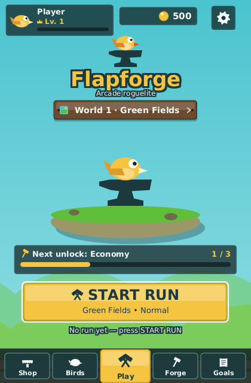
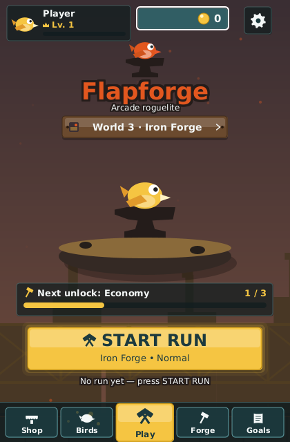

_Idioma:_ [[English|Home-Hub]] · **Português (Brasil)**

# A tela inicial

A primeira tela depois da inicialização é a tela inicial (o *hub*). Ela lê como a capa de um
roguelite de arcade, não como uma lista de opções: o que você vai voar em seguida está na tela,
o que está prestes a desbloquear também, e um botão dourado inicia a partida.

*Um perfil novo: Campos Verdes selecionado, nível 1, a árvore de economia a um nível de distância
(interface em inglês).*

## De cima para baixo

| Elemento | O que mostra | O que abre |
| --- | --- | --- |
| **Cartão do jogador** (canto superior esquerdo) | Sua ave selecionada como avatar, "Jogador", uma coroa com o seu nível, a barra de XP e o selo de prestígio depois que você prestigiar | O **Perfil**: o mesmo cabeçalho, suas estatísticas de todos os tempos, o histórico de partidas e o painel de prestígio |
| **Chip de moedas** (centro superior) | Suas moedas, rolando quando uma partida acabou de pagar | A **Loja** |
| **Engrenagem** (canto superior direito) | — | **Configurações** |
| **Emblema e título** | A ave na bigorna, "Flapforge", "Arcade roguelite" | — |
| **Placa do mundo** | "Mundo 1 · Campos Verdes ›": o mundo em que a próxima partida será jogada, com uma amostra da paleta | A tela **Escolha um mundo** — veja [[Mundos e chefes|Mundos-e-Chefes-(pt-BR)]] |
| **Cena da forja** | Sua ave na bigorna, em uma ilha flutuante na paleta do mundo selecionado, sobre o cenário desse mundo | — (ela cresce, veja abaixo) |
| Cartão **Próximo desbloqueio** | O item desbloqueável mais próximo que você ainda pode conquistar, com o contador ("Economia 1 / 3") e uma barra dourada | A tela em que esse tipo de item é conquistado ou comprado: Aves, Escolha um mundo, Forja, Metas ou a Loja |
| **INICIAR PARTIDA** | O botão dourado principal, com "Mundo • Dificuldade" embaixo | A partida, no mundo e no nível de dificuldade que a placa e a tela Aves indicam |
| **Linha da última partida** | "Última partida: 12 portões · +48 moedas   Recorde: 31" — ou um convite para tocar em INICIAR PARTIDA | — |
| **Barra inferior** | Loja · Aves · **Jogar** · Forja · Metas | Cada item abre a sua tela; Jogar inicia a mesma partida que INICIAR PARTIDA |

### A forja cresce com você

A cena do meio é um retrato da sua progressão. Cada nível comprado nas árvores de melhorias
(veja [[Loja e melhorias|Loja-e-Melhorias-(pt-BR)]]) acrescenta algo a ela:

| Níveis de melhoria comprados | A forja |
| --- | --- |
| 0 | A ilha, a bigorna e a sua ave, apagada |
| 1 | A fornalha acende com um brilho pulsante e um martelo se apoia na bigorna |
| 6 | Um barril |
| 14 | Um estandarte na cor de destaque do mundo |
| 22 | Um segundo barril e um braseiro |
| 36 | Detalhe dourado na bigorna, uma chama mais alta e faíscas ocasionais |

Um perfil que já prestigiou carrega o detalhe dourado em qualquer estágio. A ilha, o céu e as
barras laterais seguem o mundo selecionado: Céu de Tempestade é uma ilha escura sob raios, e O
Vazio é quase preto.

*Forja de Ferro selecionado: a placa, a paleta, o cenário e o subtítulo de INICIAR PARTIDA
acompanham (interface em inglês).*

### Forja, Metas e os outros nomes

- **Forja** na barra inferior abre toda a oficina de melhorias — as árvores Voo, Economia e
  Forja, na tela chamada *Melhorias*. Não é só a árvore Forja, nem o mundo Forja de Ferro, nem a
  ave Brasa (Cinder).
- **Metas** reúne os sete desafios, as 41 conquistas, os marcos e as coleções em quatro abas —
  veja [[Desafios e metas|Desafios-e-Metas-(pt-BR)]].
- **Aves** é onde você escolhe a ave, as cores e o equipamento, e onde o mundo, o nível de
  dificuldade e o modo da partida são definidos atrás de uma barra de uma linha — veja
  [[Aves e habilidades|Aves-e-Habilidades-(pt-BR)]] e
  [[Modos de jogo e dificuldade|Modos-de-Jogo-e-Dificuldade-(pt-BR)]]. Ela traz esta mesma barra
  inferior, com Aves na placa dourada.
- O **Perfil** atrás do cartão do jogador é onde fica o prestígio em duas etapas.

## Teclado, mouse e toque

- As setas e `Tab` movem o foco: INICIAR PARTIDA começa focado, `Baixo` chega a Jogar na barra
  inferior, `Esquerda`/`Direita` percorrem a barra e dão a volta nas pontas, `Cima` sobe até o
  cartão de próximo desbloqueio, a placa e a faixa superior. `Enter` ou `Espaço` ativa; todo
  controle também reage a passar o mouse, clicar e tocar.
- `Esc` (ou Voltar no Android) mostra "Pressione de novo para sair"; um segundo toque em até três
  segundos fecha o jogo. Abrir qualquer tela nesse intervalo cancela o pedido. No computador,
  Configurações › Sobre também tem uma linha Sair.
- Deixe a tela inicial parada por vinte segundos e um robô joga uma partida de demonstração atrás
  dela, escurecida sob a interface. Qualquer tecla, clique ou movimento do ponteiro traz a tela de
  volta.

> **Dica:** a tela inicial é viva. Comprar uma ave na Loja, selecionar um mundo, prestigiar ou
> terminar uma partida aparece no instante em que você volta — sem reiniciar, sem reabrir.

## Sem um perfil

Quando o jogo roda sem um salvamento (a execução sem janela, alguns testes), a tela inicial ainda
mostra o cartão do jogador, a engrenagem e INICIAR PARTIDA, desativa Loja, Aves, Forja e Metas, e
esconde o chip de moedas, a placa e o cartão de próximo desbloqueio. Todo o resto se comporta da
mesma forma.
